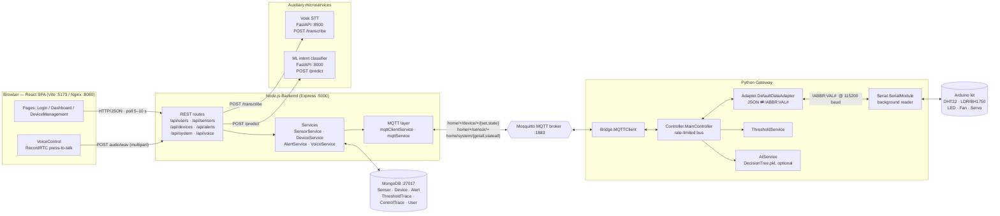
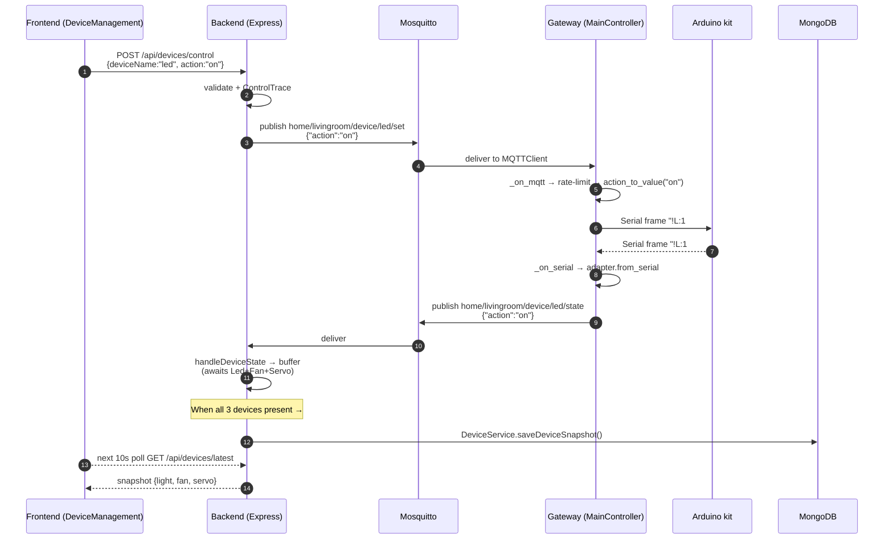
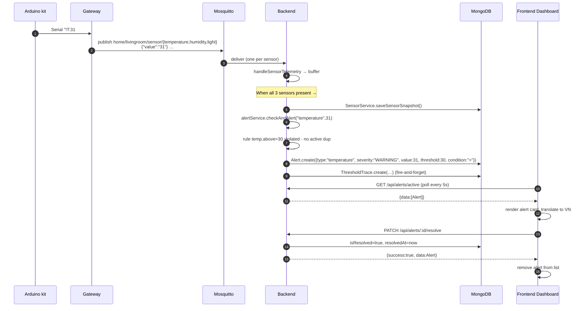

# YOLOHome — Architecture Report

> A single end-to-end reference for the YOLOHome smart-home monitoring & control system: every component, every communication channel, every public interface, plus how to deploy it.
>
> All references use file:line links so the reader can jump straight from a claim to the line of code that backs it up.

---

## Table of contents

1. [Executive summary](#1-executive-summary)
2. [High-level architecture diagram](#2-high-level-architecture-diagram)
3. [Component inventory](#3-component-inventory)
4. [Communication channels](#4-communication-channels)
5. [Public interfaces (reference tables)](#5-public-interfaces-reference-tables)
6. [Key cross-cutting mechanisms](#6-key-cross-cutting-mechanisms)
7. [Deployment & operations](#7-deployment--operations)
8. [Glossary & references](#8-glossary--references)

---

## 1. Executive summary

**YOLOHome** is a smart-home monitoring & control system that lets a user observe live environmental sensors (temperature, humidity, light), control three actuators (LED, fan, servo), receive automated threshold-based alerts, and issue voice commands through a push-to-talk web UI. The project root [README.md](README.md) describes it in Vietnamese as "Hệ thống giám sát và điều khiển nhà thông minh" — a smart-home monitoring & control system composed of a website (Frontend + Backend API), a Gateway bridging MQTT and Serial, an MQTT broker, and MongoDB.

The system is organised in **five logical layers** plus two auxiliary microservices:

| Layer | Role | Tech |
|---|---|---|
| **UI** | Browser SPA | React 19 + Vite |
| **REST API** | HTTP gateway, persistence, MQTT broker peer | Express 5 + Mongoose |
| **Message bus** | Pub/Sub between Backend and Gateway | Mosquitto (MQTT) |
| **Gateway bridge** | Protocol translation MQTT ↔ Serial, automation | Python + paho-mqtt + pyserial |
| **Hardware** | Sensors + actuators | Arduino-compatible kit over USB serial |
| _Aux_ — **STT** | Speech → text | FastAPI + Vosk |
| _Aux_ — **Intent** | Text → device:action | FastAPI + scikit-learn (joblib) |

Six containerised services are declared in [docker-compose.yml](docker-compose.yml): `frontend` (Nginx :8080), `backend` (Node :5000), `gateway` (Python), `mqtt` (Mosquitto :1883), `mongo` (Mongo :27017). The Vosk and ML microservices live in [YOLOHome-Website/backend/stt_service/](YOLOHome-Website/backend/stt_service/) and [YOLOHome-Website/backend/ml_service/](YOLOHome-Website/backend/ml_service/) and are launched separately when the voice feature is exercised.

Three flagship flows summarise the runtime behaviour: **(A)** a user toggle traverses HTTP → MQTT → Serial to flip a relay, **(B)** sensor readings stream from kit → Gateway → MQTT → Backend where they are buffered, persisted, and threshold-checked into alerts, **(C)** push-to-talk audio is transcribed by Vosk, classified by the ML intent model, and re-enters Flow A starting from MQTT. The full sequence diagrams are in §4.

---

## 2. High-level architecture diagram

### 2.1 Mermaid component graph



### 2.2 ASCII fallback

<details>
<summary>Show ASCII version</summary>

```text
┌───────────────────────────────────────────────────────────────┐
│ Browser — React SPA  (Vite :5173  /  Nginx :8080)             │
│   Login · Dashboard · DeviceManagement · VoiceControl (PTT)   │
└────────────┬──────────────────────────────┬───────────────────┘
             │ HTTP/JSON (poll 5–10 s)      │ POST audio/wav
             ▼                              ▼
┌───────────────────────────────────────────────────────────────┐
│ Node.js Backend  (Express :5000)                              │
│   routes/ → controllers/ → services/ → models/ (Mongoose)     │
│   MQTT client · AlertService · VoiceService                   │
└───┬───────────────────┬─────────────────┬─────────────────┬───┘
    │ MongoDB           │ MQTT pub/sub    │ POST /transcribe│ POST /predict
    ▼                   ▼                 ▼                 ▼
┌──────────┐    ┌────────────────┐  ┌──────────────┐  ┌──────────────┐
│ MongoDB  │    │ Mosquitto      │  │ Vosk STT     │  │ ML intent    │
│ :27017   │    │ broker :1883   │  │ FastAPI :8500│  │ FastAPI :8000│
└──────────┘    └───────┬────────┘  └──────────────┘  └──────────────┘
                        │ MQTT
                        ▼
┌───────────────────────────────────────────────────────────────┐
│ Python Gateway                                                │
│   MQTTClient ─ MainController ─ DefaultDataAdapter            │
│        │              │              │                        │
│        │              ├─ ThresholdService                     │
│        │              └─ AIService (optional)                 │
│        ▼                                                      │
│   SerialModule (background reader thread)                     │
└────────────────────────┬──────────────────────────────────────┘
                         │ Serial @ 115200 baud
                         │ Frame: !<ABBR>:<VALUE>#
                         ▼
┌───────────────────────────────────────────────────────────────┐
│ Arduino kit                                                   │
│   Sensors : DHT22 (T,H) · LDR/BH1750 (Lu)                     │
│   Actuators: LED (L) · Fan (F) · Servo (S)                    │
└───────────────────────────────────────────────────────────────┘
```

</details>

---

## 3. Component inventory

For each component below: **Purpose · Tech · Entry point · Key responsibilities · Depends on**.

### 3.1 Frontend — React SPA

- **Location:** [YOLOHome-Website/frontend/](YOLOHome-Website/frontend/)
- **Tech:** React 19.2 · React Router DOM 7 · Vite 5 · RecordRTC · lucide-react · recharts ([package.json](YOLOHome-Website/frontend/package.json))
- **Entry points:** [src/index.js](YOLOHome-Website/frontend/src/index.js) bootstraps React into `#root`; [src/App.js](YOLOHome-Website/frontend/src/App.js) defines routes and the `ProtectedRoute` guard.
- **Routes** ([App.js:22-34](YOLOHome-Website/frontend/src/App.js#L22-L34)):
  - Public: `/` (Login), `/signup`
  - Protected (auth via `localStorage.getItem('user')`): `/dashboard`, `/devices`, `/logout`, all nested under [components/Layout.js](YOLOHome-Website/frontend/src/components/Layout.js)
- **State management:** plain React hooks + `localStorage`. No Redux/Zustand/Context.
- **Live data:** HTTP polling — Dashboard polls sensors and alerts every **5 s** ([Dashboard.js:75-76](YOLOHome-Website/frontend/src/pages/Dashboard.js#L75-L76)); DeviceManagement polls devices every **10 s**.
- **REST client:** [src/services/api.js](YOLOHome-Website/frontend/src/services/api.js) wraps `fetch` against `http://localhost:5000/api`.
- **Push-to-talk:** [components/VoiceControl.js](YOLOHome-Website/frontend/src/components/VoiceControl.js) — floating button that records mono WAV @ 16 kHz with RecordRTC's `StereoAudioRecorder` ([VoiceControl.js:14-25](YOLOHome-Website/frontend/src/components/VoiceControl.js#L14-L25)), POSTs the blob to `/api/voice/command`, and shows a 5-second toast with the transcript and intent.

### 3.2 Backend — Node.js / Express 5

- **Location:** [YOLOHome-Website/backend/](YOLOHome-Website/backend/)
- **Entry point:** [server.js](YOLOHome-Website/backend/server.js) — wires CORS + JSON parsing + logging middleware, calls `setupRoutes(app)`, opens MongoDB and MQTT, and registers SIGTERM/SIGINT shutdown handlers.
- **Layered structure:** `routes/` → `controllers/` → `services/` → `models/` (Mongoose). See [routes/index.js](YOLOHome-Website/backend/routes/index.js) for the route mount table.
- **Sub-modules to call out:**
  - **MQTT** — [services/mqtt/mqttClientService.js](YOLOHome-Website/backend/services/mqtt/mqttClientService.js) is a thin wrapper over `mqtt.connect`; [services/mqtt/mqttService.js](YOLOHome-Website/backend/services/mqtt/mqttService.js) routes incoming messages and exposes `sendDeviceCommand` / `sendGetAll`; [services/mqtt/mqttTopics.js](YOLOHome-Website/backend/services/mqtt/mqttTopics.js) is the single source of truth for topic strings.
  - **AlertService** — [services/alertService.js](YOLOHome-Website/backend/services/alertService.js): lazy-loads threshold rules from the Gateway's `config.yml`, dedups active alerts, persists `Alert` + `ThresholdTrace`.
  - **VoiceService** — [services/voiceService.js](YOLOHome-Website/backend/services/voiceService.js): orchestrates Vosk → ML → MQTT publish and writes a `ControlTrace`.
  - **DeviceService / SensorService / UserService** — [services/](YOLOHome-Website/backend/services/): thin Mongoose accessors and snapshot persistence.
  - **SystemController** — [controllers/systemController.js](YOLOHome-Website/backend/controllers/systemController.js): turns a `GET /api/system/getall` HTTP call into an MQTT `home/system/getall` request and awaits the `…/stateall` reply (5 s timeout from [config/mqtt.js:9](YOLOHome-Website/backend/config/mqtt.js#L9)).
- **Models** (all Mongoose): `Sensor`, `Device`, `Alert` (7-day TTL), `ThresholdTrace`, `ControlTrace`, `User` — see [models/](YOLOHome-Website/backend/models/) and §5.4.

### 3.3 Gateway — Python

- **Location:** [YOLOHome-Gateway/GateWay/](YOLOHome-Gateway/GateWay/)
- **Entry point:** [GateWay/run.py](YOLOHome-Gateway/GateWay/run.py) loads `config.yml`, builds a `YOLOHomeGateway` orchestrator, runs a setup pipeline ([run.py:132-255](YOLOHome-Gateway/GateWay/run.py#L132-L255)), and enters an infinite loop with `loop_interval` from config (default 0.1 s).
- **Modules:**
  - [Bridge/mqtt_client.py](YOLOHome-Gateway/GateWay/Bridge/mqtt_client.py) — paho-mqtt wrapper with `start()`/`stop()`/`publish()`/`set_callback()`.
  - [Serial/serial_control.py](YOLOHome-Gateway/GateWay/Serial/serial_control.py) — pyserial wrapper with a background reader thread.
  - [Adapter/default_adapter.py](YOLOHome-Gateway/GateWay/Adapter/default_adapter.py) — bidirectional translator between MQTT JSON and the Serial `!ABBR:VAL#` frame.
  - [Controller/controller.py](YOLOHome-Gateway/GateWay/Controller/controller.py) — `MainController`: the central bus that wires MQTT and Serial together via `_on_mqtt`/`_on_serial`, enforces rate limits, and dispatches threshold/AI automation ([controller.py:215-333](YOLOHome-Gateway/GateWay/Controller/controller.py#L215-L333)).
  - [Controller/services/threshold_service.py](YOLOHome-Gateway/GateWay/Controller/services/threshold_service.py) — evaluates `automation.thresholds.*` rules from `config.yml`.
  - [Controller/services/ai_service.py](YOLOHome-Gateway/GateWay/Controller/services/ai_service.py) — optional Decision-Tree-driven automation (off by default; see [config.yml:46](YOLOHome-Gateway/config.yml#L46)).
- **Important: the gateway can run "kit-offline".** If the serial port fails to open, `setup()` swaps in a `unittest.mock.MagicMock` and the loop continues ([run.py:155-186](YOLOHome-Gateway/GateWay/run.py#L155-L186)) — useful for dev without hardware.

### 3.4 Auxiliary microservices

| Service | Path | Endpoint | Purpose |
|---|---|---|---|
| **Vosk STT** | [YOLOHome-Website/backend/stt_service/vosk_server.py](YOLOHome-Website/backend/stt_service/vosk_server.py) | `POST /transcribe` (default port 8500, env `VOSK_SERVER_URL`) | Convert WAV (mono 8 / 16 kHz) → transcript |
| **ML intent classifier** | [YOLOHome-Website/backend/ml_service/ml_server.py](YOLOHome-Website/backend/ml_service/ml_server.py) | `POST /predict` (default port 8000, env `ML_SERVICE_URL`) | Classify text → intent string `"device:action"` |

Both load their model at process start (Vosk model directory configured by `VOSK_MODEL_PATH`; the intent classifier loads `intent_model.pkl` via `joblib`). Models on disk live under [models/](models/) (top-level) and `YOLOHome-Gateway/GateWay/Voice/models/`.

### 3.5 Data stores

- **MongoDB** — see §5.4 for schemas. The Mongoose connection is bootstrapped in [config/database.js](YOLOHome-Website/backend/config/database.js) and `connectDatabase()` is awaited before the HTTP listen ([server.js:48-50](YOLOHome-Website/backend/server.js#L48-L50)). The compose file pins a Docker volume `mongo_data` for persistence ([docker-compose.yml:13-22](docker-compose.yml#L13-L22)).
- **Mosquitto** — broker config under [mosquitto/](mosquitto/), mounted read-only into the container ([docker-compose.yml:4-11](docker-compose.yml#L4-L11)).

### 3.6 Hardware kit

- **Wire:** USB serial, 115 200 baud, 1 s read timeout ([config.yml:23-27](YOLOHome-Gateway/config.yml#L23-L27)).
- **Sensors:** temperature (`T`), humidity (`H`), light (`Lu`).
- **Actuators:** LED relay (`L`), fan relay (`F`), servo (`S`).
- **Abbreviation map:** [config.yml:75-82](YOLOHome-Gateway/config.yml#L75-L82).

---

## 4. Communication channels

This section is the *graph in prose*: every edge of the diagram in §2.1 paired with a paragraph describing its protocol, trigger, payload, and the file:line that defines it on either side.

### 4.1 HTTP REST — Frontend → Backend

The Frontend talks to Express via plain `fetch` against `http://localhost:5000/api` ([api.js:1](YOLOHome-Website/frontend/src/services/api.js#L1)). The complete endpoint table is in [§5.1](#51-rest-api). Highlights:

- **`POST /api/devices/control`** — sent from [DeviceManagement.js](YOLOHome-Website/frontend/src/pages/DeviceManagement.js) toggle. Handler [deviceController.js:24-98](YOLOHome-Website/backend/controllers/deviceController.js#L24-L98) validates `action ∈ {on, off}`, asks `mqttService.sendDeviceCommand` to publish the matching MQTT topic, and writes a `ControlTrace` audit row. Returns `{ success, data: { device, action, accepted } }`.
- **`GET /api/sensors/latest`** and **`GET /api/devices/latest`** — Mongoose snapshot reads ([sensorController.js](YOLOHome-Website/backend/controllers/sensorController.js), [deviceController.js:11-21](YOLOHome-Website/backend/controllers/deviceController.js#L11-L21)). These are the targets of the Dashboard and DeviceManagement polling loops.
- **`GET /api/alerts/active`** — returns `{ success, count, data: [Alert] }` filtered by `isResolved: false` ([alertController.js:23-34](YOLOHome-Website/backend/controllers/alertController.js#L23-L34) → [alertService.js:161-165](YOLOHome-Website/backend/services/alertService.js#L161-L165)). The Dashboard polls this every 5 s.
- **`PATCH /api/alerts/:id/resolve`** — sets `isResolved: true, resolvedAt: now` ([alertController.js:36-52](YOLOHome-Website/backend/controllers/alertController.js#L36-L52)). Fired when the user clicks **Xác nhận** ([Dashboard.js:174-178](YOLOHome-Website/frontend/src/pages/Dashboard.js#L174-L178)).
- **`POST /api/voice/command`** — multipart upload field name **`audio`** ([api.js:88-103](YOLOHome-Website/frontend/src/services/api.js#L88-L103) and [voiceRoutes.js:9-27](YOLOHome-Website/backend/routes/voiceRoutes.js#L9-L27)), max 5 MB, kept in memory by `multer`.
- **`GET /api/system/getall`** — synchronously waits up to **5 s** ([config/mqtt.js:9](YOLOHome-Website/backend/config/mqtt.js#L9)) for the Gateway's MQTT reply on `home/system/stateall`; on timeout the controller returns HTTP 504 ([systemController.js:25-32](YOLOHome-Website/backend/controllers/systemController.js#L25-L32)).

### 4.2 HTTP — Backend → auxiliary microservices

Both calls happen inside `handleVoiceCommand` ([voiceService.js:34-72](YOLOHome-Website/backend/services/voiceService.js#L34-L72)):

- **Vosk** — `transcribeWithVosk(audioBuffer)` from [utils/voskProvider.js](YOLOHome-Website/backend/utils/voskProvider.js): multipart POST to `VOSK_SERVER_URL` (default `http://localhost:8500/transcribe`), **field name `file`**, returns `{ transcript }`. Note the field-name asymmetry — the *browser* uses `audio`, the *backend → Vosk* hop uses `file`.
- **ML intent** — `axios.post(mlUrl, { text: transcript })` against `ML_SERVICE_URL` (default `http://localhost:8000/predict`), returns `{ intent }`. The intent is normalised by `normalizeIntent` ([voiceService.js:6-25](YOLOHome-Website/backend/services/voiceService.js#L6-L25)) into `{ device, action, raw }`. Failure modes: an empty transcript or unrecognised intent throws, the error is logged into `ControlTrace` ([voiceService.js:73-78](YOLOHome-Website/backend/services/voiceService.js#L73-L78)), and the HTTP response is 500.

### 4.3 MQTT — Backend ↔ Broker ↔ Gateway

The Backend connects via `mqtt.connect` ([mqttClientService.js:11-58](YOLOHome-Website/backend/services/mqtt/mqttClientService.js#L11-L58)) with QoS taken from env (default 1) and reconnects every 2 s. It subscribes to **three wildcard topic families** ([mqttTopics.js:25-29](YOLOHome-Website/backend/services/mqtt/mqttTopics.js#L25-L29)):

```js
// YOLOHome-Website/backend/services/mqtt/mqttTopics.js:25-29
export const MQTT_SUBSCRIBE_TOPICS = Object.freeze([
    MQTT_DEVICE_TOPICS.subscribeState,  // home/+/device/+/state
    MQTT_SENSOR_TOPICS.subscribeState,  // home/+/sensor/+
    MQTT_SYSTEM_TOPICS.subscribeAll     // home/system/+
]);
```

The Gateway publishes onto those three families and subscribes to the corresponding "set" family ([config.yml:10-14](YOLOHome-Gateway/config.yml#L10-L14)):

```yaml
# YOLOHome-Gateway/config.yml:10-14
mqtt:
  subscribe_topics:
    - home/livingroom/device/led/set
    - home/livingroom/device/fan/set
    - home/livingroom/device/servo/set
    - home/system/getall
```

Full topic schema is in [§5.2](#52-mqtt-topic-schema). The **buffering** mechanism deserves attention — backend snapshot persistence and threshold-checking only fire once **all three** sensors (or **all three** device states) have arrived, see [§6.1](#61-sensor-and-device-snapshot-buffering).

**Sequence — Flow A: manual LED toggle**



### 4.4 Serial UART — Gateway ↔ Kit

Wire-level framing is `!<ABBR>:<VALUE>#` ([default_adapter.py:1-15](YOLOHome-Gateway/GateWay/Adapter/default_adapter.py#L1-L15)). The `MainController._on_serial` accepts batched frames like `!T:27#!H:50#` and splits them with a regex ([controller.py:335-348](YOLOHome-Gateway/GateWay/Controller/controller.py#L335-L348)):

```python
# YOLOHome-Gateway/GateWay/Controller/controller.py:335-348
def _split_serial_frames(self, raw_data: str) -> List[str]:
    if not raw_data:
        return []
    # Supports both spaced and concatenated batches, e.g. '!T:27#!H:50#'.
    frames = re.findall(r"![^!#]+#", raw_data)
    ...
```

The abbreviation table is defined in [config.yml:75-82](YOLOHome-Gateway/config.yml#L75-L82) and reproduced in [§5.3](#53-serial-wire-protocol). Outbound sends use `_to_serial` ([controller.py:350-378](YOLOHome-Gateway/GateWay/Controller/controller.py#L350-L378)), inbound receives feed `_on_serial` which also runs threshold/AI automation (`_check_threshold` at [controller.py:90-113](YOLOHome-Gateway/GateWay/Controller/controller.py#L90-L113)) before re-publishing the state on MQTT.

### 4.5 MongoDB — write paths

| Collection | Written by | Trigger |
|---|---|---|
| `Sensor` | `SensorService.saveSensorSnapshot` (via [mqttService.js:182-187](YOLOHome-Website/backend/services/mqtt/mqttService.js#L182-L187)) | All 3 sensor MQTT messages buffered, or `home/system/stateall` received |
| `Device` | `DeviceService.saveDeviceSnapshot` (via [mqttService.js:137-148](YOLOHome-Website/backend/services/mqtt/mqttService.js#L137-L148)) | All 3 device-state MQTT messages buffered, or `home/system/stateall` received |
| `Alert` | `alertService.checkAndAlert` ([alertService.js:230-237](YOLOHome-Website/backend/services/alertService.js#L230-L237)) | Sensor snapshot complete and threshold violated (with active-alert dedup) |
| `ThresholdTrace` | `alertService.checkAndAlert` ([alertService.js:239-250](YOLOHome-Website/backend/services/alertService.js#L239-L250)) | Same event as `Alert` — fire-and-forget |
| `ControlTrace` | `deviceController.controlDevice` and `voiceService.handleVoiceCommand` | Any device-control HTTP call or voice command (success + failure paths) |
| `User` | `UserService.createUser` via `POST /api/users/signup` | User registration |

### 4.6 File / config interfaces

- **`YOLOHome-Gateway/config.yml`** ([file](YOLOHome-Gateway/config.yml)) is the **single source of truth for thresholds**. It is loaded by the Gateway at startup (`load_config` in [run.py:22-44](YOLOHome-Gateway/GateWay/run.py#L22-L44)) and — *importantly* — also lazy-loaded by the Backend's AlertService from a path computed in [alertService.js:46-51](YOLOHome-Website/backend/services/alertService.js#L46-L51) (env `GATEWAY_CONFIG_PATH` overrides). Defaults from [alertService.js:33-44](YOLOHome-Website/backend/services/alertService.js#L33-L44) are used if the file cannot be read.
- **Backend `.env`** (loaded by `dotenv` in [config/config.js](YOLOHome-Website/backend/config/config.js) and [config/mqtt.js](YOLOHome-Website/backend/config/mqtt.js)) — see [§5.5](#55-configuration-interface). `MONGO_URI` is the only hard requirement; the process `exit(1)`s without it ([config/config.js:13-19](YOLOHome-Website/backend/config/config.js#L13-L19)).
- **Model files** — `intent_model.pkl` loaded at ML-service start ([ml_server.py:12-15](YOLOHome-Website/backend/ml_service/ml_server.py#L12-L15)); `vosk-model-small-vi` folder loaded by Vosk ([vosk_server.py:6-9](YOLOHome-Website/backend/stt_service/vosk_server.py#L6-L9)); Decision-Tree model under `YOLOHome-Gateway/Decision_tree/curtain_model.pkl` referenced by [config.yml:47](YOLOHome-Gateway/config.yml#L47).

### 4.7 Sequence — Flow B: Threshold alert



### 4.8 Sequence — Flow C: Push-to-talk voice command

```mermaid
sequenceDiagram
  autonumber
  participant USER as User
  participant VC as VoiceControl (browser)
  participant BE as Backend (/api/voice/command)
  participant VOSK as Vosk :8500
  participant ML as ML :8000
  participant MQTT as Mosquitto
  participant GW as Gateway
  participant KIT as Arduino kit

  USER->>VC: press-and-hold mic button
  VC->>VC: RecordRTC start (mono 16kHz WAV)
  USER->>VC: release
  VC->>BE: POST /api/voice/command (multipart "audio")
  BE->>VOSK: POST /transcribe (field "file")
  VOSK-->>BE: {transcript:"bật đèn"}
  BE->>ML: POST /predict {text:"bật đèn"}
  ML-->>BE: {intent:"led:on"}
  BE->>BE: normalizeIntent → {device:"led",action:"on"}
  BE->>MQTT: publish home/default/device/led/set {"action":"on"}
  Note over BE,MQTT: location defaults to "default" — diverges from <br/>gateway's livingroom subscriptions; see §6.5
  BE-->>VC: {status:"success", data:{transcript, intent}}
  VC->>VC: show toast 5 s
  MQTT->>GW: (if topic matches subscription)
  GW->>KIT: Serial "!L:1#"
```

---

## 5. Public interfaces (reference tables)

### 5.1 REST API

Authoritative source: [routes/index.js](YOLOHome-Website/backend/routes/index.js) and the per-route files. Cross-check with [backend/API_DOCS.md](YOLOHome-Website/backend/API_DOCS.md) which documents the same endpoints in tutorial style.

| Method | Path | Handler | Frontend caller | Request | Response |
|---|---|---|---|---|---|
| `GET` | `/health` | inline in [routes/index.js:10-16](YOLOHome-Website/backend/routes/index.js#L10-L16) | — | — | `{ status:"OK", message, timestamp }` |
| `POST` | `/api/users/signup` | [userController.js:5-41](YOLOHome-Website/backend/controllers/userController.js#L5-L41) | [api.js:42-63](YOLOHome-Website/frontend/src/services/api.js#L42-L63) | `{username, password, fullName}` | `201 {success, message, data:user}` |
| `POST` | `/api/users/login` | [userController.js:43-83](YOLOHome-Website/backend/controllers/userController.js#L43-L83) | [api.js:65-85](YOLOHome-Website/frontend/src/services/api.js#L65-L85) | `{username, password}` | `200 {success, data:user}` — stored in `localStorage.user` |
| `GET` | `/api/sensors/latest` | [sensorController.js:5-15](YOLOHome-Website/backend/controllers/sensorController.js#L5-L15) | [api.js:4-12](YOLOHome-Website/frontend/src/services/api.js#L4-L12) | — | `{success, data}` (latest `Sensor` doc, polled every 5 s) |
| `GET` | `/api/devices/latest` | [deviceController.js:11-21](YOLOHome-Website/backend/controllers/deviceController.js#L11-L21) | [api.js:15-23](YOLOHome-Website/frontend/src/services/api.js#L15-L23) | — | `{success, data}` (latest `Device` doc, polled every 10 s) |
| `POST` | `/api/devices/control` | [deviceController.js:24-98](YOLOHome-Website/backend/controllers/deviceController.js#L24-L98) | [api.js:25-39](YOLOHome-Website/frontend/src/services/api.js#L25-L39) | `{deviceName\|deviceType, action\|status:"on"\|"off"}` | `{success, data:{device, action, accepted}}` |
| `GET` | `/api/alerts` | [alertController.js:3-21](YOLOHome-Website/backend/controllers/alertController.js#L3-L21) | — | query `?isResolved&limit&skip` | `{success, count, data}` |
| `GET` | `/api/alerts/active` | [alertController.js:23-34](YOLOHome-Website/backend/controllers/alertController.js#L23-L34) | [api.js:106-115](YOLOHome-Website/frontend/src/services/api.js#L106-L115) | — | `{success, count, data:[Alert]}` (polled every 5 s) |
| `PATCH` | `/api/alerts/:id/resolve` | [alertController.js:36-52](YOLOHome-Website/backend/controllers/alertController.js#L36-L52) | [api.js:117-130](YOLOHome-Website/frontend/src/services/api.js#L117-L130) | path `id` | `{success, data:Alert}` or `404` |
| `DELETE` | `/api/alerts/:id` | [alertController.js:54-70](YOLOHome-Website/backend/controllers/alertController.js#L54-L70) | — | path `id` | `{success, message}` |
| `GET` | `/api/system/getall` | [systemController.js:15-33](YOLOHome-Website/backend/controllers/systemController.js#L15-L33) | — | — | `{success, data:{temp, humi, light, led, fan, servo}}` (each may be `null`; HTTP `504` on MQTT timeout) |
| `POST` | `/api/voice/command` | [voiceRoutes.js:16-27](YOLOHome-Website/backend/routes/voiceRoutes.js#L16-L27) | [api.js:88-103](YOLOHome-Website/frontend/src/services/api.js#L88-L103) | `multipart/form-data` field **`audio`** (WAV, ≤5 MB) | `{status:"success", data:{transcript, intent:{device, action, raw}}}` |

### 5.2 MQTT topic schema

Defined in [services/mqtt/mqttTopics.js](YOLOHome-Website/backend/services/mqtt/mqttTopics.js) on the Backend side and built by [Adapter/default_adapter.py](YOLOHome-Gateway/GateWay/Adapter/default_adapter.py) on the Gateway side. Defaults: prefix `home`, location `livingroom`.

| Topic | Direction | Publisher | Subscriber | Payload | Trigger |
|---|---|---|---|---|---|
| `home/{room}/device/{led\|fan\|servo}/set` | BE → GW | [mqttService.js:333-336](YOLOHome-Website/backend/services/mqtt/mqttService.js#L333-L336) (`sendDeviceCommand`) | [config.yml:11-13](YOLOHome-Gateway/config.yml#L11-L13) Gateway subscription → [controller.py:215-289](YOLOHome-Gateway/GateWay/Controller/controller.py#L215-L289) `_on_mqtt` | `{"action":"on"\|"off"}` | `POST /api/devices/control`, or voice intent |
| `home/{room}/device/{led\|fan\|servo}/state` | GW → BE | [controller.py:380-413](YOLOHome-Gateway/GateWay/Controller/controller.py#L380-L413) `_to_mqtt` | [mqttService.js:109-154](YOLOHome-Website/backend/services/mqtt/mqttService.js#L109-L154) `handleDeviceState` | `{"action":"on"\|"off"}` | Kit echo / threshold automation |
| `home/{room}/sensor/{temperature\|humidity\|light}` | GW → BE | [controller.py:380-413](YOLOHome-Gateway/GateWay/Controller/controller.py#L380-L413) | [mqttService.js:156-203](YOLOHome-Website/backend/services/mqtt/mqttService.js#L156-L203) `handleSensorTelemetry` | `{"value":"<number>"}` | Kit sensor read |
| `home/system/getall` | BE → GW | [mqttService.js:368-372](YOLOHome-Website/backend/services/mqtt/mqttService.js#L368-L372) `sendGetAll` | [controller.py:231-242](YOLOHome-Gateway/GateWay/Controller/controller.py#L231-L242) (calls `_getall`) | `{}` | `GET /api/system/getall` |
| `home/system/stateall` | GW → BE | [controller.py:434-468](YOLOHome-Gateway/GateWay/Controller/controller.py#L434-L468) `_getall` | [mqttService.js:205-256](YOLOHome-Website/backend/services/mqtt/mqttService.js#L205-L256) `handleSystemSnapshot` + resolves the pending `getall` promise ([mqttService.js:278-282](YOLOHome-Website/backend/services/mqtt/mqttService.js#L278-L282)) | `{"temp":…, "humi":…, "light":…, "led":"on/off", "fan":…, "servo":…}` | Response to `getall` |

**QoS & retain:** QoS comes from env `MQTT_QOS` (default 1, [config/mqtt.js:7](YOLOHome-Website/backend/config/mqtt.js#L7)); `retain` is off by default (env `MQTT_RETAIN`). **Rate limiting:** Gateway enforces `mqtt_to_serial=0.1 s` and `serial_to_mqtt=0.5 s` per `{direction}_{device}` key ([controller.py:193-213](YOLOHome-Gateway/GateWay/Controller/controller.py#L193-L213), [config.yml:35-39](YOLOHome-Gateway/config.yml#L35-L39)).

### 5.3 Serial wire protocol

Frame: `!<ABBR>:<VALUE>#`. Batched frames like `!T:27#!H:50#!Lu:200#` are accepted as a single read and split by the regex `![^!#]+#` ([controller.py:341](YOLOHome-Gateway/GateWay/Controller/controller.py#L341)).

| Abbr | Device | Direction | Example | Notes |
|---|---|---|---|---|
| `T` | Temperature sensor | KIT → GW | `!T:25.5#` | float, °C |
| `H` | Humidity sensor | KIT → GW | `!H:65#` | int %, 0–100 |
| `Lu` | Light sensor | KIT → GW | `!Lu:450#` | int lux |
| `L` | LED relay | bidirectional | `!L:1#` / `!L:0#` | switch: 1=on, 0=off |
| `F` | Fan relay | bidirectional | `!F:1#` / `!F:0#` | switch |
| `S` | Servo | bidirectional | `!S:1#` / `!S:0#` | switch in current config |

Mapping table is in [config.yml:75-82](YOLOHome-Gateway/config.yml#L75-L82); the switch/sensor metadata is at [config.yml:86-116](YOLOHome-Gateway/config.yml#L86-L116) and feeds `device_service.is_switch` / `is_sensor` checks inside the controller.

### 5.4 MongoDB collections

| Collection | Model | Schema | Index / TTL |
|---|---|---|---|
| `sensors` | [models/Sensor.js](YOLOHome-Website/backend/models/Sensor.js) | `{temperature:Number, humidity:Number, light:Number, timestamp:Date}` | none |
| `devices` | [models/Device.js](YOLOHome-Website/backend/models/Device.js) | `{light:enum, fan:enum, servo:enum, timestamp:Date}` (`enum:["on","off"]`) | none |
| `alerts` | [models/Alert.js](YOLOHome-Website/backend/models/Alert.js) | `{type:enum, severity:enum, message, value, threshold, condition, isResolved, resolvedAt, createdAt}` | `{isResolved:1, createdAt:-1}`; **TTL 604 800 s (7 days) on `createdAt`** |
| `threshold_traces` | [models/ThresholdTrace.js](YOLOHome-Website/backend/models/ThresholdTrace.js) | `{timestamp, sensorId, sensorType, value, thresholdId, thresholdName, thresholdValue, triggerDirection, actionTaken, status, errorMsg}` | `timestamp` index |
| `control_traces` | [models/ControlTrace.js](YOLOHome-Website/backend/models/ControlTrace.js) | `{timestamp, userId, source, action, payload, mqttTopic, mqttPayload, status, errorMsg}` | `timestamp` index |
| `users` | [models/User.js](YOLOHome-Website/backend/models/User.js) | `{username:unique, password, fullName, createdAt}` | `unique` on `username` |

`Alert` enums: `type ∈ {temperature, humidity, light, system}`, `severity ∈ {INFO, WARNING, CRITICAL}` ([Alert.js:3-13](YOLOHome-Website/backend/models/Alert.js#L3-L13)).

### 5.5 Configuration interface

**Backend env vars** (loaded by [config/config.js](YOLOHome-Website/backend/config/config.js) and [config/mqtt.js](YOLOHome-Website/backend/config/mqtt.js)):

| Var | Default | Used for |
|---|---|---|
| `PORT` | `5000` | Express listen port |
| `NODE_ENV` | `development` | logging / behaviour |
| `MONGO_URI` | _required_ | MongoDB connection |
| `CORS_ORIGIN` | `*` | CORS allow-list |
| `MQTT_ENABLED` | `true` | Toggle MQTT layer off for tests |
| `MQTT_BROKER_URL` | `mqtt://localhost:1883` | Broker URL |
| `MQTT_USERNAME` / `MQTT_PASSWORD` | empty | Broker auth |
| `MQTT_CLIENT_ID` | random | Per-process MQTT client id |
| `MQTT_QOS` | `1` | Publish/subscribe QoS |
| `MQTT_RETAIN` | `false` | Retain flag |
| `ML_SERVICE_URL` | `http://localhost:8000/predict` | ML intent endpoint |
| `VOSK_SERVER_URL` | `http://localhost:8500/transcribe` | Vosk endpoint |
| `GATEWAY_CONFIG_PATH` | computed in [alertService.js:46-51](YOLOHome-Website/backend/services/alertService.js#L46-L51) | Path used by AlertService to read thresholds |

**Gateway `config.yml` keys** (see [YOLOHome-Gateway/config.yml](YOLOHome-Gateway/config.yml)):

- `mqtt.{host, port, username, password, subscribe_topics, topics.{prefix,location,system_getall,system_state_all}}`
- `serial.{port, baudrate, timeout}`
- `app.{loop_interval, log_level, state_history_size}`
- `rate_limit.{mqtt_to_serial, serial_to_mqtt}`
- `automation.{threshold.enabled, ai.{enabled,model_path}, thresholds.{temp,humi,light}.[].{device, above, below, on_value, off_value}}`
- `devices.{temp,humi,light,led,fan,servo}` → serial abbreviations
- `managed_devices.<name>.{type, unit, is_switch, description}`

---

## 6. Key cross-cutting mechanisms

### 6.1 Sensor and device snapshot buffering

The Backend persists **one row per snapshot**, not per individual MQTT message. `handleSensorTelemetry` stores each incoming value into a module-level buffer and waits until all three sensors are present before writing to MongoDB, running alerts, and clearing the buffer ([mqttService.js:156-203](YOLOHome-Website/backend/services/mqtt/mqttService.js#L156-L203)):

```js
// YOLOHome-Website/backend/services/mqtt/mqttService.js:171-203 (abridged)
sensorSnapshotBuffer[sensorType] = value;
const hasFullSnapshot =
    sensorSnapshotBuffer.temperature !== null &&
    sensorSnapshotBuffer.humidity !== null &&
    sensorSnapshotBuffer.light !== null;
if (!hasFullSnapshot) return;

await SensorService.saveSensorSnapshot({ ...sensorSnapshotBuffer, timestamp: new Date() });
await alertService.checkAndAlert('temperature', sensorSnapshotBuffer.temperature);
await alertService.checkAndAlert('humidity',    sensorSnapshotBuffer.humidity);
await alertService.checkAndAlert('light',       sensorSnapshotBuffer.light);
sensorSnapshotBuffer.temperature = sensorSnapshotBuffer.humidity = sensorSnapshotBuffer.light = null;
```

The same pattern applies to the device buffer ([mqttService.js:126-152](YOLOHome-Website/backend/services/mqtt/mqttService.js#L126-L152)). **Consequence:** if even one sensor never arrives, *nothing* is persisted and *no* alert fires — restart the Gateway with all three sensors wired to recover. The `home/system/stateall` path takes a different, single-shot route ([mqttService.js:205-256](YOLOHome-Website/backend/services/mqtt/mqttService.js#L205-L256)).

### 6.2 Threshold alert pipeline

Rules are config-driven. `alertService.refreshThresholds` reads [YOLOHome-Gateway/config.yml](YOLOHome-Gateway/config.yml) (path overridable via `GATEWAY_CONFIG_PATH`) and translates the YAML to a JS structure keyed by sensor type ([alertService.js:82-144](YOLOHome-Website/backend/services/alertService.js#L82-L144)). If the read fails, hard-coded defaults are used ([alertService.js:33-44](YOLOHome-Website/backend/services/alertService.js#L33-L44)).

Each call to `checkAndAlert(sensorType, value)`:
1. Loads thresholds lazily on first call.
2. Iterates rules; checks `above`/`below`.
3. **Dedups** by querying for an existing un-resolved `Alert` with the same `type`, `condition`, `threshold` ([alertService.js:211-220](YOLOHome-Website/backend/services/alertService.js#L211-L220)) — prevents the same alert from being created twice while still active.
4. Writes a new `Alert` and a parallel `ThresholdTrace` audit row.

### 6.3 Voice pipeline

Three serial hops: STT → intent → MQTT. The contract is short enough to read in full ([voiceService.js:27-80](YOLOHome-Website/backend/services/voiceService.js#L27-L80)):

```js
// YOLOHome-Website/backend/services/voiceService.js:34-66 (abridged)
const transcript = await transcribe(audioBuffer);                       // Vosk
if (!transcript) throw new Error('No speech recognized');
const mlResp = await axios.post(ML_SERVICE_URL, { text: transcript });  // ML
const intent = normalizeIntent(mlResp.data.intent);                     // → {device, action}
const topic = `home/${intent.location || 'default'}/device/${intent.device}/set`;
await mqttClientService.publish(topic, { action: intent.action });
ControlTrace.create({ source:'frontend', action:`voice_${intent.action}_${intent.device}`, … });
```

### 6.4 Gateway rate limiting

The controller maintains a `last_update_timestamp` dict keyed by `{direction}_{device}` and checks against the per-direction limits from `config.yml` (`mqtt_to_serial=0.1 s`, `serial_to_mqtt=0.5 s`). The check is in `_ok_to_send` ([controller.py:193-213](YOLOHome-Gateway/GateWay/Controller/controller.py#L193-L213)) and used in both `_on_mqtt` and `_on_serial` *and* in the automation dispatcher `_check_threshold` (under key `automation_<device>`). Rate-limited messages are logged at DEBUG and **silently dropped** — they are not queued.

### 6.5 Failure & fallback behaviour

- **`MQTT_ENABLED=false`** — Backend skips `mqttClientService.start()` ([mqttService.js:289-292](YOLOHome-Website/backend/services/mqtt/mqttService.js#L289-L292)) and `sendDeviceCommand` returns `{published:false, skipped:true}` ([mqttService.js:326-331](YOLOHome-Website/backend/services/mqtt/mqttService.js#L326-L331)). The HTTP control endpoint still succeeds (with `accepted:false`) and logs a `ControlTrace` of status `failure`.
- **MQTT broker timeout on `getall`** — `waitForResponse` rejects after 5 s and the controller returns HTTP **504** ([systemController.js:25-32](YOLOHome-Website/backend/controllers/systemController.js#L25-L32)).
- **Vosk or ML service unreachable** — `axios` throws; `handleVoiceCommand` records a failure `ControlTrace` and bubbles the error as HTTP 500.
- **Serial port missing** — Gateway substitutes a `MagicMock` and keeps running so the MQTT-side bus stays alive ([run.py:155-186](YOLOHome-Gateway/GateWay/run.py#L155-L186)). MQTT-to-Serial publishes succeed silently against the mock; nothing reaches the kit.
- **Voice MQTT topic uses `location:"default"`** — `voiceService` builds `home/default/device/.../set` when the intent omits a location ([voiceService.js:52-56](YOLOHome-Website/backend/services/voiceService.js#L52-L56)), but the Gateway only subscribes to `home/livingroom/device/.../set` ([config.yml:11-13](YOLOHome-Gateway/config.yml#L11-L13)). For voice control to actually flip a relay, either the ML model must return a `location` field, the gateway subscription must be widened to `home/+/device/+/set`, or the default in `voiceService` must be changed to `livingroom`. Worth knowing when verifying.

---

## 7. Deployment & operations

### 7.1 Service topology (from [docker-compose.yml](docker-compose.yml))

| Service | Image / build | Host port | Depends on | Key env / volumes |
|---|---|---|---|---|
| `mqtt` | `eclipse-mosquitto:latest` | `1883` | — | `./mosquitto/mosquitto.conf:ro` |
| `mongo` | `mongo:latest` | `27017` | — | volume `mongo_data`, env `MONGO_INITDB_DATABASE=yolohome` |
| `backend` | build `./YOLOHome-Website/backend` | `5000` | `mongo`, `mqtt` | `MONGO_URI=mongodb://mongo:27017/yolohome`, `MQTT_BROKER_URL=mqtt://mqtt:1883`, `MQTT_ENABLED=true` |
| `frontend` | build `./YOLOHome-Website/frontend` | `8080` (→ container 80) | `backend` | Nginx serves the Vite build |
| `gateway` | build `./YOLOHome-Gateway` | — | `mqtt` | mounts `config.docker.yml` read-only at `/app/config.yml`, maps host serial device to `COM15`, runs `privileged: true` |

Note that the **Vosk and ML services are not in the compose file**. They are run separately via `uvicorn` from their respective folders ([stt_service](YOLOHome-Website/backend/stt_service/) and [ml_service](YOLOHome-Website/backend/ml_service/)) when the voice feature is exercised.

### 7.2 Default ports

| Port | Service |
|---|---|
| `8080` | Frontend (Nginx serving Vite build) |
| `5173` | Frontend (Vite dev server, `npm start` outside Docker) |
| `5000` | Backend REST API |
| `1883` | Mosquitto MQTT broker |
| `27017` | MongoDB |
| `8000` | ML intent classifier (FastAPI) — dev only |
| `8500` | Vosk STT (FastAPI) — dev only |

### 7.3 Docker bring-up

From [README.md](README.md):

```bash
# Bring everything up
docker compose up -d --build

# Stop containers but keep DB volume
docker compose stop

# Stop and delete data (including Mongo volume)
docker compose down -v
```

Serial mapping is in [docker-compose.yml:67-69](docker-compose.yml#L67-L69):

```yaml
# Change the left-hand side to your host's actual serial port. Keep COM15 on the right
devices:
  - "/dev/ttyUSB0:COM15"
```

### 7.4 Local dev mode (no Docker)

| Component | Command | From |
|---|---|---|
| MQTT broker | `mosquitto -c mosquitto/mosquitto.conf` | repo root |
| MongoDB | (any local instance on 27017) | — |
| Backend | `npm install && node server.js` (env `MONGO_URI`, `MQTT_BROKER_URL`) | [YOLOHome-Website/backend/](YOLOHome-Website/backend/) |
| Frontend | `npm install && npm start` (Vite dev) | [YOLOHome-Website/frontend/](YOLOHome-Website/frontend/) |
| Gateway | `pip install -r requirements.txt && python GateWay/run.py` | [YOLOHome-Gateway/](YOLOHome-Gateway/) |
| Vosk STT | `uvicorn vosk_server:app --port 8500` (needs `VOSK_MODEL_PATH`) | [YOLOHome-Website/backend/stt_service/](YOLOHome-Website/backend/stt_service/) |
| ML intent | `uvicorn ml_server:app --port 8000` (needs `MODEL_PATH`) | [YOLOHome-Website/backend/ml_service/](YOLOHome-Website/backend/ml_service/) |

A quick smoke test once the backend is up: `curl http://localhost:5000/health` should return `{"status":"OK", ...}`.

---

## 8. Glossary & references

### 8.1 Glossary

- **MQTT topic prefix / location** — the configurable `home/{location}/…` prefix in [config.yml:17-21](YOLOHome-Gateway/config.yml#L17-L21) and [mqttTopics.js:1-2](YOLOHome-Website/backend/services/mqtt/mqttTopics.js#L1-L2). Defaults to `home/livingroom`.
- **QoS** — MQTT quality-of-service level (0/1/2). YOLOHome defaults to 1 (at-least-once).
- **Snapshot** — a Mongo row containing the most recent value for *all three* sensors (or all three actuators). The Backend writes one per complete buffer (§6.1).
- **Threshold trace** — audit row in `threshold_traces` recording every time a sensor reading crossed a configured limit and an alert was raised.
- **Control trace** — audit row in `control_traces` recording every device-control HTTP call and voice command, success or failure.
- **Intent** — the output of the ML classifier, normalised to `{ device, action }`. Format on the wire is the string `"<device>:<action>"`.
- **Push-to-talk (PTT)** — the press-and-hold microphone button in [VoiceControl.js](YOLOHome-Website/frontend/src/components/VoiceControl.js).

### 8.2 Companion documents

- Root [README.md](README.md) — Docker quick-start (Vietnamese).
- [YOLOHome-Website/backend/README.md](YOLOHome-Website/backend/README.md) and [API_DOCS.md](YOLOHome-Website/backend/API_DOCS.md) — endpoint details and request examples.
- [YOLOHome-Gateway/README.md](YOLOHome-Gateway/README.md) — gateway-only operating notes.
- [YOLOHome-Gateway/docs/](YOLOHome-Gateway/docs/) — protocol notes (serial framing, threshold rules).
- [YOLOHome-Website/backend/docs/](YOLOHome-Website/backend/docs/) — backend internal notes.
- [data/](data/) — sample threshold_alerts dataset referenced by commit `4a47fb6 add threshold_alerts doc`.
