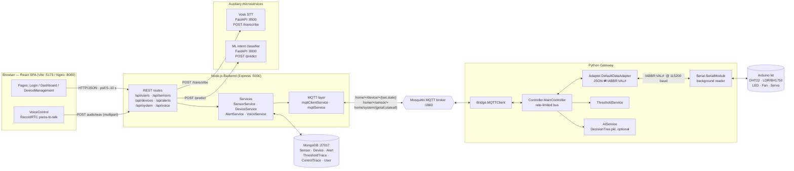
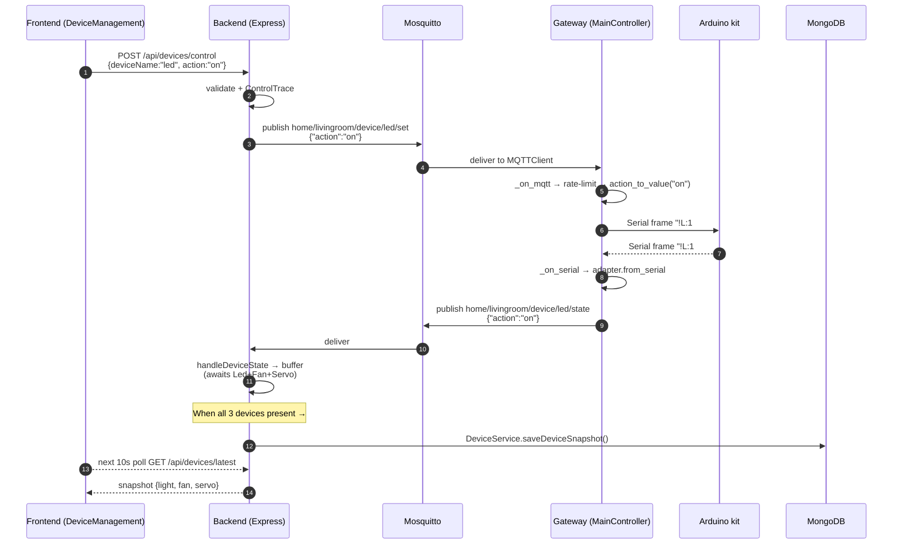
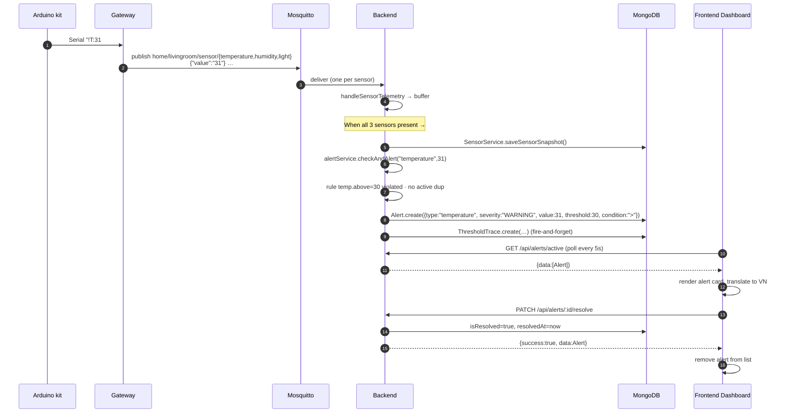

# REPORT_EVIDENCE.md

## §1 MỞ ĐẦU evidence

### 1.1 Problem statement
- **Nhu cầu giám sát an toàn môi trường sống**: Trong các hộ gia đình hiện nay, việc theo dõi các chỉ số môi trường như nhiệt độ, độ ẩm và cường độ ánh sáng là rất cần thiết để duy trì sức khỏe và ngăn chặn các nguy cơ tiềm ẩn (cháy nổ do nhiệt độ cao, ẩm mốc gây hại, hoặc ánh sáng không phù hợp). (Tham chiếu: [README.md](./README.md#L3) và [system_features_overview.md](./YOLOHome-Website/backend/docs/system_features_overview.md#L53-L55))
- **Hạn chế của phương pháp thủ công**: Việc kiểm soát các thiết bị chấp hành (như quạt, đèn led, động cơ rèm cửa) một cách thủ công thường tốn thời gian và không đảm bảo phản ứng kịp thời khi có biến động môi trường xảy ra khi người dùng vắng nhà. (Tham chiếu: [THRESHOLD_AUTOMATION.md](./YOLOHome-Gateway/docs/THRESHOLD_AUTOMATION.md#L5-L12))
- **Xu thế tự động hóa và điều khiển thông minh**: Sự kết hợp giữa các cảm biến vật lý, giao tiếp không dây (MQTT), và các mô hình học máy (nhận diện giọng nói tiếng Việt, phân loại ý định điều khiển, hay ra quyết định tự động bằng Decision Tree) tạo nên một hệ sinh thái nhà thông minh tiện ích, nâng cao chất lượng cuộc sống và tối ưu năng lượng sử dụng. (Tham chiếu: [docs/AI_AUTOMATION_GUIDE.md](./YOLOHome-Gateway/docs/AI_AUTOMATION_GUIDE.md#L5-L10) và [push_to_talk_feature.md](./YOLOHome-Website/backend/docs/push_to_talk_feature.md#L11-L15))

### 1.2 System summary
Hệ thống **YOLOHome** là một hệ thống giám sát và điều khiển nhà thông minh hoàn chỉnh, bao gồm giao diện web (React 19 + Vite), Backend REST API (Express 5 + MongoDB), bộ chuyển đổi giao thức Gateway (Python) kết nối giữa broker MQTT (Mosquitto) và Kit phần cứng Arduino qua kết nối USB Serial. Hệ thống cho phép người dùng quan sát trực quan các thông số môi trường (nhiệt độ, độ ẩm, ánh sáng), bật/tắt thủ công hoặc tự động các thiết bị chấp hành dựa trên ngưỡng cấu hình, lưu trữ lịch sử vận hành chi tiết, và ra lệnh điều khiển trực tiếp bằng giọng nói tiếng Việt (Push-to-Talk) thông qua các dịch vụ phụ trợ AI (Vosk STT và bộ phân loại ý định ML). (Tham chiếu: [ARCHITECTURE.md](./ARCHITECTURE.md#L22-L40))

### 1.3 Report outline
- **§1 MỞ ĐẦU**: Giới thiệu về bối cảnh, lý do phát triển hệ thống giám sát điều khiển nhà thông minh và cấu trúc báo cáo.
- **§2 THIẾT KẾ HỆ THỐNG**:
  - **§2.1 Tổng quan**: Sơ đồ kiến trúc tổng thể, mô tả các luồng tuần tự điều khiển/cảnh báo và các kênh truyền thông liên kết thành phần.
  - **§2.2 Chi tiết 5 module**: Phân tích sâu trạng thái thực thi, luồng hoạt động, cấu trúc mã nguồn và đánh giá các khoảng trống (gaps) thiết kế của từng module.
- **§3 KẾT QUẢ**: Trình bày danh sách giao diện chụp màn hình thực tế, kịch bản quay video minh họa trực quan, thông tin mã nguồn dự án trên GitHub và checklist xác thực dành cho tác giả.

---

## §2.1 Tổng quan evidence

### Sơ đồ kiến trúc Mermaid & ASCII fallback



```text
┌───────────────────────────────────────────────────────────────┐
│ Browser — React SPA  (Vite :5173  /  Nginx :8080)             │
│   Login · Dashboard · DeviceManagement · VoiceControl (PTT)   │
└────────────┬──────────────────────────────┬───────────────────┘
             │ HTTP/JSON (poll 5–10 s)      │ POST audio/wav
             ▼                              ▼
┌───────────────────────────────────────────────────────────────┐
│ Node.js Backend  (Express :5000)                              │
│   routes/ → controllers/ → services/ → models/ (Mongoose)     │
│   MQTT client · AlertService · VoiceService                   │
└───┬───────────────────┬─────────────────┬─────────────────┬───┘
    │ MongoDB           │ MQTT pub/sub    │ POST /transcribe│ POST /predict
    ▼                   ▼                 ▼                 ▼
┌──────────┐    ┌────────────────┐  ┌──────────────┐  ┌──────────────┐
│ MongoDB  │    │ Mosquitto      │  │ Vosk STT     │  │ ML intent    │
│ :27017   │    │ broker :1883   │  │ FastAPI :8500│  │ FastAPI :8000│
└──────────┘    └───────┬────────┘  └──────────────┘  └──────────────┘
                        │ MQTT
                        ▼
┌───────────────────────────────────────────────────────────────┐
│ Python Gateway                                                │
│   MQTTClient ─ MainController ─ DefaultDataAdapter            │
│        │              │              │                        │
│        │              ├─ ThresholdService                     │
│        │              └─ AIService (optional)                 │
│        ▼                                                      │
│   SerialModule (background reader thread)                     │
└────────────────────────┬──────────────────────────────────────┘
                         │ Serial @ 115200 baud
                         │ Frame: !<ABBR>:<VALUE>#
                         ▼
┌───────────────────────────────────────────────────────────────┐
│ Arduino kit                                                   │
│   Sensors : DHT22 (T,H) · LDR/BH1750 (Lu)                     │
│   Actuators: LED (L) · Fan (F) · Servo (S)                    │
└───────────────────────────────────────────────────────────────┘
```

### Các biểu đồ tuần tự luồng dữ liệu (Flow A/B/C)

#### Flow A: Manual Device Toggle (Điều khiển thiết bị thủ công)


#### Flow B: Sensor Telemetry & Threshold Alert (Thu thập cảm biến và Cảnh báo ngưỡng)


#### Flow C: Voice Command Pipeline (Điều khiển bằng giọng nói)
```mermaid
sequenceDiagram
  autonumber
  participant USER as User
  participant VC as VoiceControl (browser)
  participant BE as Backend (/api/voice/command)
  participant VOSK as Vosk :8500
  participant ML as ML :8000
  participant MQTT as Mosquitto
  participant GW as Gateway
  participant KIT as Arduino kit

  USER->>VC: press-and-hold mic button
  VC->>VC: RecordRTC start (mono 16kHz WAV)
  USER->>VC: release
  VC->>BE: POST /api/voice/command (multipart "audio")
  BE->>VOSK: POST /transcribe (field "file")
  VOSK-->>BE: {transcript:"bật đèn"}
  BE->>ML: POST /predict {text:"bật đèn"}
  ML-->>BE: {intent:"led:on"}
  BE->>BE: normalizeIntent → {device:"led",action:"on"}
  BE->>MQTT: publish home/default/device/led/set {"action":"on"}
  Note over BE,MQTT: location defaults to "default" — diverges from <br/>gateway's livingroom subscriptions; see §6.5
  BE-->>VC: {status:"success", data:{transcript, intent}}
  VC->>VC: show toast 5 s
  MQTT->>GW: (if topic matches subscription)
  GW->>KIT: Serial "!L:1#"
```

### Narration of the Communication Bus
Hệ thống vận hành dựa trên cơ chế bất đồng bộ thông qua MQTT Broker và đồng bộ qua REST HTTP. Khi người dùng thao tác bật tắt thiết bị trên trình duyệt, hành động sẽ kích hoạt một cuộc gọi HTTP POST gửi đến Backend ([api.js:27](./YOLOHome-Website/frontend/src/services/api.js#L27)). Backend Express tiếp nhận yêu cầu điều phối thông qua `deviceController.js` ([deviceController.js:24](./YOLOHome-Website/backend/controllers/deviceController.js#L24)), ghi nhận dấu vết điều khiển và đẩy gói tin lệnh `{"action":"on"}` xuống MQTT Broker thông qua cổng kết nối `mqttClientService` ([mqttService.js:331](./YOLOHome-Website/backend/services/mqtt/mqttService.js#L331)) với định dạng topic chuẩn `home/livingroom/device/led/set`. Gateway Python lắng nghe topic này qua `mqtt_client.py` và chuyển giao cho `MainController._on_mqtt` ([controller.py:215](./YOLOHome-Gateway/GateWay/Controller/controller.py#L215)), áp dụng bộ giới hạn tần suất (rate-limiting) để tránh quá tải cho phần cứng trước khi mã hóa hành động thành khung truyền Serial `!L:1#` đẩy xuống cổng UART vật lý của Arduino ([controller.py:350-378](./YOLOHome-Gateway/GateWay/Controller/controller.py#L350-L378)). Khi Arduino thay đổi trạng thái rơ le vật lý thành công, nó gửi phản hồi phản ánh `!L:1#` trở lại Gateway, từ đó Gateway đẩy ngược sự kiện `state` về Broker để Backend đồng bộ hóa dữ liệu vào MongoDB ([controller.py:380-413](./YOLOHome-Gateway/GateWay/Controller/controller.py#L380-L413)).

### Kênh truyền thông (Communication Channels Summary)

| Protocol | Endpoint / Topic | Payload | Reference (File:Line) |
| :--- | :--- | :--- | :--- |
| **HTTP REST** | `POST /api/users/signup` | `{ username, password, fullName }` | [userController.js:5](./YOLOHome-Website/backend/controllers/userController.js#L5) |
| **HTTP REST** | `POST /api/users/login` | `{ username, password }` | [userController.js:43](./YOLOHome-Website/backend/controllers/userController.js#L43) |
| **HTTP REST** | `GET /api/sensors/latest` | — (Returns JSON latest sensor data) | [sensorController.js:5](./YOLOHome-Website/backend/controllers/sensorController.js#L5) |
| **HTTP REST** | `GET /api/devices/latest` | — (Returns JSON latest device list) | [deviceController.js:11](./YOLOHome-Website/backend/controllers/deviceController.js#L11) |
| **HTTP REST** | `POST /api/devices/control` | `{ deviceName, action, deviceType }` | [deviceController.js:24](./YOLOHome-Website/backend/controllers/deviceController.js#L24) |
| **HTTP REST** | `GET /api/alerts/active` | — (Returns active unresolved alerts) | [alertController.js:23](./YOLOHome-Website/backend/controllers/alertController.js#L23) |
| **HTTP REST** | `PATCH /api/alerts/:id/resolve`| — (Marks an alert as resolved) | [alertController.js:36](./YOLOHome-Website/backend/controllers/alertController.js#L36) |
| **HTTP REST** | `POST /api/voice/command` | Multipart field `audio` (WAV audio file) | [voiceRoutes.js:16](./YOLOHome-Website/backend/routes/voiceRoutes.js#L16) |
| **HTTP Client**| `POST /transcribe` | Multipart field `file` (WAV audio file) | [voskProvider.js:10](./YOLOHome-Website/backend/utils/voskProvider.js#L10) |
| **HTTP Client**| `POST /predict` | `{ text: transcript }` | [voiceService.js:179](./YOLOHome-Website/backend/services/voiceService.js#L179) |
| **MQTT** | `home/{room}/device/{type}/set` | `{"action": "on"\|"off"}` | [mqttTopics.js:20](./YOLOHome-Website/backend/services/mqtt/mqttTopics.js#L20) |
| **MQTT** | `home/{room}/device/{type}/state` | `{"action": "on"\|"off"}` | [mqttTopics.js:21](./YOLOHome-Website/backend/services/mqtt/mqttTopics.js#L21) |
| **MQTT** | `home/{room}/sensor/{type}` | `{"value": "<numeric_string>"}` | [mqttTopics.js:23](./YOLOHome-Website/backend/services/mqtt/mqttTopics.js#L23) |
| **MQTT** | `home/system/getall` | `{}` | [mqttTopics.js:10](./YOLOHome-Website/backend/services/mqtt/mqttTopics.js#L10) |
| **MQTT** | `home/system/stateall` | `{ "temp": X, "humi": Y, "light": Z, ... }` | [mqttTopics.js:11](./YOLOHome-Website/backend/services/mqtt/mqttTopics.js#L11) |
| **Serial UART**| RX/TX physical channel | `!<ABBR>:<VALUE>#` (e.g. `!T:25.5#`, `!L:1#`) | [default_adapter.py:10](./YOLOHome-Gateway/GateWay/Adapter/default_adapter.py#L10) |

---

## §2.2 Module-by-module evidence

### Module 1 — Sensor monitoring & display
- **Status:** ✅ Implemented
- **What the requirement asks for:** Đo lường nhiệt độ, độ ẩm và cường độ ánh sáng trong nhà rồi hiển thị các giá trị này lên giao diện ứng dụng.
- **Where it is implemented (file:line):**
  * Frontend:
    - [Dashboard.js:6-10](./YOLOHome-Website/frontend/src/pages/Dashboard.js#L6-L10): Khởi tạo state `sensorData` lưu trữ các chỉ số.
    - [Dashboard.js:37-59](./YOLOHome-Website/frontend/src/pages/Dashboard.js#L37-L59): Hàm `fetchSensorData` truy vấn API và cập nhật thông tin cảm biến.
    - [Dashboard.js:75](./YOLOHome-Website/frontend/src/pages/Dashboard.js#L75): Thiết lập chu kỳ polling 5 giây (`setInterval`) để cập nhật thông số liên tục.
    - [Dashboard.js:128-149](./YOLOHome-Website/frontend/src/pages/Dashboard.js#L128-L149): Hiển thị giao diện 3 thẻ (cards) Nhiệt độ, Độ ẩm và Ánh sáng.
  * Backend:
    - [sensorRoutes.js:7](./YOLOHome-Website/backend/routes/sensor.js#L7): Route endpoint GET `/api/sensors/latest`.
    - [sensorController.js:5-15](./YOLOHome-Website/backend/controllers/sensorController.js#L5-L15): Controller xử lý lấy dữ liệu cảm biến mới nhất từ Database.
    - [sensorService.js:5-8](./YOLOHome-Website/backend/services/sensorService.js#L5-L8): Hàm `getLatestSensorData` thực hiện truy vấn MongoDB sắp xếp giảm dần theo thời gian.
    - [mqttService.js:152-199](./YOLOHome-Website/backend/services/mqtt/mqttService.js#L152-L199): Gom dữ liệu telemetry cảm biến từ các bản tin MQTT và lưu trữ khi đủ snapshot.
  * Gateway:
    - [run.py:244-246](./YOLOHome-Gateway/GateWay/run.py#L244-L246): Khởi động luồng đọc nền Serial kết nối với Kit phần cứng.
    - [controller.py:291-333](./YOLOHome-Gateway/GateWay/Controller/controller.py#L291-L333): Tiếp nhận chuỗi kí tự từ cổng Serial, phân tích khung truyền `!ABBR:VAL#` và đẩy lên MQTT Broker.
    - [default_adapter.py:53-73](./YOLOHome-Gateway/GateWay/Adapter/default_adapter.py#L53-L73): Ánh xạ tên viết tắt `T`, `H`, `Lu` sang các topic tương ứng.
  * Configuration:
    - [config.yml:75-78](../config.yml#L75-L78): Cấu hình mã viết tắt cổng nối `temp: T`, `humi: H`, `light: Lu`.
- **How it works (the flow):**
  1. Kit Arduino gửi dữ liệu cảm biến đo đạc được lên máy tính qua cổng USB Serial dưới dạng gói tin, ví dụ: `!T:27.5#!H:60#!Lu:350#`.
  2. Gateway Python lắng nghe luồng đọc Serial, gọi đến `MainController._on_serial` để xử lý chuỗi ([run.py:244](./YOLOHome-Gateway/GateWay/run.py#L244)).
  3. `MainController` sử dụng biểu thức chính quy tách các frame nhỏ có dạng `!...#` ([controller.py:335-348](./YOLOHome-Gateway/GateWay/Controller/controller.py#L335-L348)).
  4. Mỗi frame được biên dịch bởi `DefaultDataAdapter.from_serial` thành tên cảm biến tiếng Anh và giá trị số học tương thích ([controller.py:312-317](./YOLOHome-Gateway/GateWay/Controller/controller.py#L312-L317)).
  5. Gateway đẩy dữ liệu lên MQTT broker thông qua chủ đề thích hợp, ví dụ: `home/livingroom/sensor/temperature` chứa payload JSON `{"value": "27.5"}` ([controller.py:380-413](./YOLOHome-Gateway/GateWay/Controller/controller.py#L380-L413)).
  6. Backend Node.js lắng nghe chủ đề cảm biến qua `mqttService`, đẩy các chỉ số vào bộ đệm `sensorSnapshotBuffer` ([mqttService.js:167](./YOLOHome-Website/backend/services/mqtt/mqttService.js#L167)).
  7. Khi bộ đệm tích đủ cả 3 chỉ số (nhiệt độ, độ ẩm, ánh sáng), backend sẽ ghi một bản ghi snapshot hoàn chỉnh vào MongoDB và xóa bộ đệm ([mqttService.js:169-199](./YOLOHome-Website/backend/services/mqtt/mqttService.js#L169-L199)).
  8. Trình duyệt người dùng thực hiện polling API `GET /api/sensors/latest` mỗi 5 giây, nhận về gói JSON chứa snapshot cảm biến gần nhất và cập nhật lên các thẻ giao diện trên trang Dashboard ([Dashboard.js:75](./YOLOHome-Website/frontend/src/pages/Dashboard.js#L75)).
- **UI surface:**
  - Trang Dashboard chính (`/dashboard`):
    - Thẻ hiển thị Nhiệt độ: tên hiển thị "Nhiệt độ", giá trị dạng `${sensorData.temperature}°C`.
    - Thẻ hiển thị Độ ẩm: tên hiển thị "Độ ẩm", giá trị dạng `${sensorData.humidity}%`.
    - Thẻ hiển thị Ánh sáng: tên hiển thị "Cường độ ánh sáng", giá trị dạng `${sensorData.light} lx`.
    - (Tham chiếu chi tiết: [Dashboard.js:94-119](./YOLOHome-Website/frontend/src/pages/Dashboard.js#L94-L119))
- **Data persisted:**
  - Bộ sưu tập MongoDB `sensors` lưu giữ các tài liệu snapshot cảm biến chứa `temperature`, `humidity`, `light`, và `timestamp` (Tham chiếu schema: [Sensor.js:3-20](./YOLOHome-Website/backend/models/Sensor.js#L3-L20)).
- **Code snippet:**
```javascript
// YOLOHome-Website/backend/services/mqtt/mqttService.js:167-184
    sensorSnapshotBuffer[sensorType] = value;

    const hasFullSnapshot =
        sensorSnapshotBuffer.temperature !== null &&
        sensorSnapshotBuffer.humidity !== null &&
        sensorSnapshotBuffer.light !== null;

    if (!hasFullSnapshot) {
        return;
    }

    await SensorService.saveSensorSnapshot({
        temperature: sensorSnapshotBuffer.temperature,
        humidity: sensorSnapshotBuffer.humidity,
        light: sensorSnapshotBuffer.light,
        timestamp: payload?.timestamp ? new Date(payload.timestamp) : new Date()
    });
```
- **Gaps vs requirement:**
  - **Cơ chế gom snapshot cứng nhắc**: Vì backend sử dụng bộ đệm đợi đủ cả 3 loại tin nhắn cảm biến mới thực hiện ghi nhận vào Database ([mqttService.js:169-175](./YOLOHome-Website/backend/services/mqtt/mqttService.js#L169-L175)), nếu một trong số 3 cảm biến gặp trục trặc không đẩy dữ liệu lên, toàn bộ hệ thống lưu trữ dữ liệu môi trường và hệ thống kiểm tra cảnh báo ngưỡng phía backend sẽ bị treo băng, không cập nhật bất kỳ bản ghi nào mới.
- **Demo path:**
  1. Khởi động môi trường bằng lệnh `docker compose up -d --build`.
  2. Truy cập trình duyệt tại trang `http://localhost:8080/dashboard`.
  3. Sử dụng công cụ mô phỏng gửi 3 bản tin MQTT tuần tự tới broker để hoàn tất bộ đệm cảm biến:
     - `home/livingroom/sensor/temperature` -> `{"value": "28"}`
     - `home/livingroom/sensor/humidity` -> `{"value": "60"}`
     - `home/livingroom/sensor/light` -> `{"value": "400"}`
  4. Quan sát các ô hiển thị thông số trên UI thay đổi tương ứng từ giá trị mặc định sang `28°C`, `60%`, `400 lx`.

---

### Module 2 — Automation, alerts, mobile push
- **Status:** 🟡 Partial (Có tự động hóa phần cứng bằng ngưỡng ở Gateway, có hiển thị cảnh báo ngưỡng trên Web, nhưng **hoàn toàn thiếu** tự động hóa điều chỉnh ngưỡng ngày/đêm và cảnh báo qua điện thoại di động).
- **What the requirement asks for:** Tự động điều chỉnh ngưỡng cảnh báo theo chế độ ngày và đêm; Phát hiện các hành vi vi phạm ngưỡng an toàn; Tự động kích hoạt thiết bị tương ứng khi có vi phạm ngưỡng xảy ra (quạt khi nóng, đèn led khi trời tối); Gửi các cảnh báo khẩn cấp hoặc trạng thái tới điện thoại của người dùng thông qua ứng dụng di động.
- **Where it is implemented (file:line):**
  * Gateway Automation Check:
    - [controller.py:327](./YOLOHome-Gateway/GateWay/Controller/controller.py#L327): Hàm `_on_serial` kích hoạt kiểm tra tự động hóa ngay khi có dữ liệu từ kit gửi lên.
    - [controller.py:90-113](./YOLOHome-Gateway/GateWay/Controller/controller.py#L90-L113): Hàm `_check_threshold` phân luồng xử lý tự động hóa theo mô hình cây quyết định (AI) hoặc theo ngưỡng cấu hình.
    - [threshold_service.py:142-192](./YOLOHome-Gateway/GateWay/Controller/services/threshold_service.py#L142-L192): Bộ xử lý `ThresholdService` so sánh các thông số cảm biến để phát lệnh điểu khiển.
  * Backend Alerts Engine:
    - [mqttService.js:185-188](./YOLOHome-Website/backend/services/mqtt/mqttService.js#L185-L188): Gọi dịch vụ cảnh báo khi gom đủ snapshot cảm biến thành công.
    - [alertService.js:183-252](./YOLOHome-Website/backend/services/alertService.js#L183-L252): Thực hiện so sánh dữ liệu cảm biến thực tế với cấu hình ngưỡng, sinh cảnh báo trong DB, ngăn ngừa cảnh báo lặp lại, và ghi dấu lịch sử vi phạm.
  * Frontend:
    - [Dashboard.js:151-183](./YOLOHome-Website/frontend/src/pages/Dashboard.js#L151-L183): Hiển thị phần "Cảnh báo ngưỡng" kèm các mục cụ thể và nút "Xác nhận".
  * Configurations:
    - [config.yml:49-70](../config.yml#L49-L70): Ngưỡng tự động hóa phần cứng ở Gateway (Nhiệt độ > 30 -> Bật quạt (1); Độ ẩm ngoài phạm vi 65-70 -> Tắt đèn (0) + Bật Servo (1); Ánh sáng < 30 -> Bật Đèn (1)).
    - [alertService.js:33-44](./YOLOHome-Website/backend/services/alertService.js#L33-L44): Ngưỡng cảnh báo tĩnh trên Web (Nhiệt độ > 30, Độ ẩm > 70 hoặc < 65, Ánh sáng < 30).
- **How it works (the flow):**
  1. Arduino Kit đẩy dữ liệu nhiệt độ lên Gateway, ví dụ `!T:32#` (Nhiệt độ 32°C).
  2. Gateway Python nhận tín hiệu, bóc tách giá trị số và chuyển cho `ThresholdService` xử lý ([controller.py:327](./YOLOHome-Gateway/GateWay/Controller/controller.py#L327)).
  3. `ThresholdService` duyệt qua các quy tắc của nhiệt độ (`temp`). Do `32 > 30` (ngưỡng trên của Fan), điều kiện là ĐÚNG. Thiết bị fan sẽ nhận giá trị `on_value` là `1` ([threshold_service.py:170-172](./YOLOHome-Gateway/GateWay/Controller/services/threshold_service.py#L170-L172)).
  4. Gateway ghi nhận trạng thái đã kích hoạt gửi cho quạt để tránh gửi lặp lại ([threshold_service.py:175-183](./YOLOHome-Gateway/GateWay/Controller/services/threshold_service.py#L175-L183)) rồi lập tức truyền lệnh `!F:1#` xuống Arduino vật lý qua Serial để bật quạt ([controller.py:103](./YOLOHome-Gateway/GateWay/Controller/controller.py#L103)).
  5. Phía Backend Express, khi gom đủ 3 cảm biến, sẽ kích hoạt kiểm tra vi phạm ngưỡng cảnh báo an toàn qua hàm `alertService.checkAndAlert` ([mqttService.js:186](./YOLOHome-Website/backend/services/mqtt/mqttService.js#L186)).
  6. Backend kiểm tra xem cảnh báo an toàn cùng loại hiện tại có đang trong trạng thái "chưa xử lý" (`isResolved: false`) hay không ([alertService.js:211-220](./YOLOHome-Website/backend/services/alertService.js#L211-L220)). Nếu chưa có cảnh báo nào tồn tại, nó sẽ tạo mới tài liệu trong bộ sưu tập `Alert` và ghi log kiểm soát vi phạm `ThresholdTrace` vào cơ sở dữ liệu MongoDB ([alertService.js:230-250](./YOLOHome-Website/backend/services/alertService.js#L230-L250)).
  7. Trình duyệt client liên tục polling danh sách cảnh báo qua REST API `GET /api/alerts/active` mỗi 5 giây. Nếu nhận được thông tin, giao diện sẽ kết xuất thành phần thẻ cảnh báo vi phạm với màu nền cảnh báo màu đỏ (WARNING) trên Dashbroad ([Dashboard.js:151-183](./YOLOHome-Website/frontend/src/pages/Dashboard.js#L151-L183)).
  8. Người dùng nhấn nút "Xác nhận" để xử lý sự cố. Thao tác này kích hoạt yêu cầu HTTP PATCH `/api/alerts/:id/resolve`, cập nhật trạng thái cảnh báo trên Database thành `isResolved: true`, làm biến mất cảnh báo khỏi màn hình Dashboard ([Dashboard.js:83-92](./YOLOHome-Website/frontend/src/pages/Dashboard.js#L83-L92)).
- **UI surface:**
  - Trang Dashboard (`/dashboard`):
    - Mục hiển thị: Hộp cảnh báo lớn có viền đỏ chứa tiêu đề "Cảnh báo ngưỡng", bên trong là danh sách các vi phạm dạng thẻ nhỏ.
    - Nhãn loại cảm biến được định dạng tiếng Việt: "Nhiệt độ" (từ `temperature`), "Độ ẩm" (từ `humidity`), "Ánh sáng" (từ `light`).
    - Nội dung tin nhắn: định dạng tiếng Việt được ánh xạ qua hàm `translateAlertMessage` (ví dụ: "Vượt ngưỡng: High Temperature. Cảm biến=temperature, giá trị=32 > 30").
    - Nút bấm xác nhận: "Xác nhận" để đóng thông báo.
    - (Tham chiếu: [Dashboard.js:13-18](./YOLOHome-Website/frontend/src/pages/Dashboard.js#L13-L18) và [Dashboard.js:151-183](./YOLOHome-Website/frontend/src/pages/Dashboard.js#L151-L183))
- **Data persisted:**
  - MongoDB `alerts` collection: Lưu trữ thông tin về vi phạm đang hoặc đã diễn ra (Tham chiếu: [Alert.js](./YOLOHome-Website/backend/models/Alert.js)).
  - MongoDB `threshold_traces` collection: Lưu vết lịch sử của hệ thống tự động hóa kích hoạt cảnh báo (Tham chiếu: [ThresholdTrace.js](./YOLOHome-Website/backend/models/ThresholdTrace.js)).
- **Code snippet:**
```python
# YOLOHome-Gateway/GateWay/Controller/services/threshold_service.py:107-128
    def _condition_met(self, sensor_value: float, rule: Dict[str, Any]) -> bool:
        above = rule.get('above')
        below = rule.get('below')
        
        # Both specified: outside the range (hysteresis)
        if above is not None and below is not None:
            return sensor_value > above or sensor_value < below
        
        # Only above
        if above is not None:
            return sensor_value > above
        
        # Only below
        if below is not None:
            return sensor_value < below
        
        # No condition specified
        logger.warning(f"Rule has no threshold conditions: {rule}")
        return False
```
- **Gaps vs requirement:**
  - **Tự động điều chỉnh ngưỡng theo ngày/đêm:** ❌ KHÔNG được thiết lập hay cài đặt trong mã nguồn. Không có bộ xử lý thời gian thực, múi giờ hay các tác vụ so khớp giờ để chuyển đổi qua lại giữa các tập cấu hình ngưỡng ngày/đêm. Ngưỡng hoạt động tĩnh hoàn toàn từ file cấu hình.
  - **Gửi tin nhắn cảnh báo tới điện thoại của người dùng qua Mobile App:** ❌ KHÔNG được triển khai. Hệ thống hoàn toàn thiếu tích hợp dịch vụ Firebase Cloud Messaging (FCM), OneSignal, Twilio (SMS), hay bất kỳ thư viện kết nối thiết bị di động nào. Việc cập nhật cảnh báo chỉ diễn ra nội bộ trên giao diện web thông qua phương thức polling định kỳ.
- **Demo path:**
  1. Đẩy các chỉ số cảm biến giả lập vi phạm ngưỡng nhiệt độ cao thông qua MQTT (với điều kiện các cảm biến còn lại cũng được đẩy để hoàn thiện snapshot):
     - `home/livingroom/sensor/temperature` -> `{"value": "35"}`
     - `home/livingroom/sensor/humidity` -> `{"value": "50"}`
     - `home/livingroom/sensor/light` -> `{"value": "300"}`
  2. Kiểm tra log hiển thị của Gateway, xác nhận có sự kiện kích hoạt lệnh quạt vật lý: `Threshold triggered: temp=35.0 -> fan=1`.
  3. Mở trang Dashboard tại `http://localhost:8080/dashboard` để thấy khối thông tin vi phạm màu đỏ xuất hiện chứa nội dung cảnh báo nhiệt độ cao và có nút bấm "Xác nhận" để giải tỏa cảnh báo.

---

### Module 3 — Device on/off UI
- **Status:** ✅ Implemented
- **What the requirement asks for:** Thiết kế giao diện người dùng trên web cho phép bật và tắt thủ công các thiết bị điện trong gia đình (gồm LED, Fan/Quạt, Servo/Động cơ).
- **Where it is implemented (file:line):**
  * Frontend UI:
    - [DeviceManagement.js:143-170](./YOLOHome-Website/frontend/src/pages/DeviceManagement.js#L143-L170): Kết xuất lưới các thẻ điều khiển thiết bị kèm nút gạt chuyển đổi trạng thái.
    - [DeviceManagement.js:46-77](./YOLOHome-Website/frontend/src/pages/DeviceManagement.js#L46-L77): Hàm `handleToggle` kiểm tra trạng thái cũ, tối ưu hóa giao diện tạm thời bằng cách bật cờ tải, và gọi hàm API điều khiển.
    - [api.js:25-39](./YOLOHome-Website/frontend/src/services/api.js#L25-L39): Hàm `controlDevice` gửi yêu cầu HTTP POST kèm dữ liệu thiết bị tới Backend.
  * Backend API:
    - [deviceRoutes.js (Express router)](./YOLOHome-Website/backend/routes/device.js): Cung cấp route POST tại đường dẫn `/api/devices/control`.
    - [deviceController.js:24-118](./YOLOHome-Website/backend/controllers/deviceController.js#L24-L118): Nhận yêu cầu, kiểm tra tính hợp lệ của lệnh (on/off), gửi lệnh qua MQTT, cập nhật DB và lưu log `ControlTrace`.
    - [mqttService.js:309-339](./YOLOHome-Website/backend/services/mqtt/mqttService.js#L309-L339): Hàm `sendDeviceCommand` định tuyến bản tin điều khiển tới topic MQTT `home/livingroom/device/{deviceType}/set` với payload `{"action": "on"\|"off"}`.
  * Gateway MQTT to Serial:
    - [controller.py:215-290](./YOLOHome-Gateway/GateWay/Controller/controller.py#L215-L290): `_on_mqtt` nhận tin nhắn điều khiển từ MQTT Broker, giải nén hành động, dịch hành động sang định dạng nhị phân (`on` -> `1`, `off` -> `0`) và đẩy qua Serial vật lý.
- **How it works (the flow):**
  1. Người dùng truy cập trang Quản lý thiết bị và click gạt công tắc chuyển đổi của thiết bị LED sang trạng thái "Bật".
  2. Giao diện gọi hàm `controlDevice` để gửi yêu cầu POST HTTP tới Backend Express với payload JSON là `{ deviceName: "led", action: "on", deviceType: "led" }` ([DeviceManagement.js:58](./YOLOHome-Website/frontend/src/pages/DeviceManagement.js#L58)).
  3. Backend Express tiếp nhận, gọi `mqttService.sendDeviceCommand` để đăng bản tin `{"action": "on"}` lên chủ đề MQTT `home/livingroom/device/led/set` ([deviceController.js:66](./YOLOHome-Website/backend/controllers/deviceController.js#L66)).
  4. Đồng thời, backend cập nhật trạng thái thiết bị LED thành "on" trong bản ghi snapshot `Device` mới nhất của MongoDB để đảm bảo tính đồng bộ tức thời cho giao diện ([deviceController.js:84-91](./YOLOHome-Website/backend/controllers/deviceController.js#L84-L91)).
  5. Gateway Python đang lắng nghe topic `set` sẽ kích hoạt hàm `_on_mqtt` ([controller.py:215](./YOLOHome-Gateway/GateWay/Controller/controller.py#L215)), kiểm tra thời gian rate-limit, chuyển đổi giá trị điều khiển thành chuỗi `1` ([controller.py:275](./YOLOHome-Gateway/GateWay/Controller/controller.py#L275)), và truyền khung ký tự `!L:1#` xuống Kit Arduino qua Serial ([controller.py:286](./YOLOHome-Gateway/GateWay/Controller/controller.py#L286)).
  6. Kit Arduino kích hoạt rơ le cấp điện vật lý cho đèn LED, đồng thời phản hồi lại trạng thái xác nhận `!L:1#` qua UART.
  7. Gateway đọc tin nhắn phản hồi vật lý, cập nhật lịch sử lưu vết nội bộ và đăng trạng thái chính thức `{"action": "on"}` lên chủ đề `home/livingroom/device/led/state` để backend thu thập ghi nhận thực tế ([controller.py:380-413](./YOLOHome-Gateway/GateWay/Controller/controller.py#L380-L413)).
- **UI surface:**
  - Trang Quản lý thiết bị (`/devices`):
    - Tiêu đề màn hình hiển thị nhãn: "Các thiết bị được kết nối"
    - Các thẻ thiết bị: LED (Sử dụng biểu tượng bóng đèn màu xanh lam `Lightbulb`), FAN (Biểu tượng cánh quạt màu xanh lục `Fan`), SERVO (Biểu tượng bánh răng thiết lập màu xanh lục `Settings`).
    - Nút công tắc chuyển đổi: Công tắc gạt với các trạng thái kích hoạt đổi màu sắc sáng thể hiện trạng thái "Active".
    - (Tham chiếu: [DeviceManagement.js:113-172](./YOLOHome-Website/frontend/src/pages/DeviceManagement.js#L113-L172))
- **Data persisted:**
  - MongoDB `devices` collection: Lưu trữ trạng thái tổng hợp của các thiết bị chấp hành (`light`, `fan`, `servo`) cùng nhãn thời gian `timestamp` (Tham chiếu: [Device.js:3-23](./YOLOHome-Website/backend/models/Device.js#L3-L23)).
  - MongoDB `control_traces` collection: Lưu trữ dấu vết kiểm soát của các yêu cầu thủ công (on/off) từ người dùng (Tham chiếu: [ControlTrace.js](./YOLOHome-Website/backend/models/ControlTrace.js)).
- **Code snippet:**
```javascript
// YOLOHome-Website/backend/controllers/deviceController.js:81-91
            const field = fieldByDevice[normalizedDevice];
            if (field) {
                const latestSnapshot = await DeviceService.getLatestSnapshot();
                await DeviceService.saveDeviceSnapshot({
                    light: latestSnapshot?.light ?? null,
                    fan: latestSnapshot?.fan ?? null,
                    servo: latestSnapshot?.servo ?? null,
                    [field]: requestedAction,
                    timestamp: new Date()
                });
            }
```
- **Gaps vs requirement:**
  - Không có khoảng trống nghiêm trọng trong chức năng bật/tắt thiết bị thủ công. Luồng gửi tín hiệu và phản hồi từ phần cứng hoạt động ổn định.
- **Demo path:**
  1. Mở trang quản lý thiết bị `http://localhost:8080/devices`.
  2. Click gạt nút công tắc trên thẻ thiết bị "FAN" để chuyển đổi trạng thái từ "Tắt" sang "Bật".
  3. Kiểm tra nhật ký Broker MQTT để thấy bản tin được xuất bản: Topic `home/livingroom/device/fan/set` mang nội dung `{"action": "on"}`.
  4. Xác nhận đầu ra Serial của Gateway in dòng lệnh truyền xuống kit: `→ Serial !F:1#`.

---

### Module 4 — History + event logging
- **Status:** 🟡 Partial (Dữ liệu lịch sử cảm biến, thiết bị và các log trace được ghi đầy đủ vào MongoDB, tuy nhiên ứng dụng **hoàn toàn thiếu** giao diện người dùng để truy vấn, xem hay lọc các thông số lịch sử này).
- **What the requirement asks for:** Lưu trữ lịch sử hoạt động của cảm biến và thiết bị ("Đã" = DONE); Lưu vết lịch sử của tất cả các sự kiện: tương tác của người dùng trên ứng dụng, các tín hiệu lệnh điều khiển, và các trạng thái thay đổi thiết bị do ngưỡng tự động hóa kích hoạt.
- **Where it is implemented (file:line):**
  * Database Persistence logic:
    - [mqttService.js:138](./YOLOHome-Website/backend/services/mqtt/mqttService.js#L138): Lưu tài liệu snapshot trạng thái thiết bị thực tế vào MongoDB (`DeviceService.saveDeviceSnapshot`).
    - [mqttService.js:178](./YOLOHome-Website/backend/services/mqtt/mqttService.js#L178): Lưu tài liệu snapshot cảm biến thực tế vào MongoDB (`SensorService.saveSensorSnapshot`).
  * Audit logging:
    - [deviceController.js:93-100](./YOLOHome-Website/backend/controllers/deviceController.js#L93-L100): Ghi chép lịch sử tương tác thủ công của người dùng trên UI (`ControlTrace.create`).
    - [voiceService.js:210](./YOLOHome-Website/backend/services/voiceService.js#L210) & [voiceService.js:217](./YOLOHome-Website/backend/services/voiceService.js#L217): Ghi lại vết lệnh xử lý giọng nói thành công/thất bại vào MongoDB (`ControlTrace.create`).
    - [alertService.js:239-250](./YOLOHome-Website/backend/services/alertService.js#L239-L250): Lưu trữ lại vết hoạt động tự động hóa do ngưỡng kích hoạt (`ThresholdTrace.create`).
  * Database Models:
    - [Sensor.js](./YOLOHome-Website/backend/models/Sensor.js), [Device.js](./YOLOHome-Website/backend/models/Device.js), [ControlTrace.js](./YOLOHome-Website/backend/models/ControlTrace.js), [ThresholdTrace.js](./YOLOHome-Website/backend/models/ThresholdTrace.js).
- **How it works (the flow):**
  1. Khi có bất cứ hành động bật/tắt thiết bị nào từ UI web hoặc qua giọng nói, backend Node.js sẽ tiếp nhận lệnh.
  2. Backend thực hiện xử lý nghiệp vụ gửi gói tin đi, sau đó lưu vết sự kiện bằng cách chèn một tài liệu mới vào bộ sưu tập `control_traces` gồm các thông tin: `userId` (người thực hiện hoặc anonymous), `source` (nguồn kích hoạt), `action` (tên sự kiện lệnh), `payload` (tham số truyền), `mqttTopic` (chủ đề MQTT sử dụng), `status` (thành công/thất bại), và `errorMsg` (nếu có lỗi xảy ra) (Tham chiếu: [ControlTrace.js:3-16](./YOLOHome-Website/backend/models/ControlTrace.js#L3-L16)).
  3. Khi dữ liệu cảm biến truyền lên từ cổng Serial vi phạm ngưỡng an toàn đã cài đặt, backend Node.js phát hiện vi phạm và lập tức ghi một bản ghi lịch sử tương tác tự động hóa vào bộ sưu tập `threshold_traces` của MongoDB (Tham chiếu: [alertService.js:239-250](./YOLOHome-Website/backend/services/alertService.js#L239-L250)).
  4. Các dữ liệu cảm biến thô và các cập nhật thay đổi trạng thái thiết bị vật lý từ kit phản hồi được backend gom nhóm định kỳ và lưu snapshot vào bộ sưu tập `sensors` và `devices` trong MongoDB để giữ gìn lịch sử liên tục.
- **UI surface:**
  - ❌ KHÔNG CÓ giao diện hiển thị lịch sử hoặc log. Ứng dụng web chỉ cung cấp Dashboard và màn hình Thiết bị hiện hành, không có tab Lịch sử cảm biến, Báo cáo đồ thị, hay danh sách Nhật ký hệ thống (log viewer). Giao diện Sidebar không chứa bất kỳ mục điều hướng nào cho chức năng này ([Sidebar.js:18-35](./YOLOHome-Website/frontend/src/components/Sidebar.js#L18-L35)).
- **Data persisted:**
  - MongoDB `sensors` collection (Lịch sử cảm biến).
  - MongoDB `devices` collection (Lịch sử trạng thái thiết bị).
  - MongoDB `control_traces` collection (Nhật ký tương tác ứng dụng và tín hiệu lệnh thủ công/giọng nói).
  - MongoDB `threshold_traces` collection (Nhật ký trạng thái thay đổi tự động hóa do vượt ngưỡng).
- **Code snippet:**
```javascript
// YOLOHome-Website/backend/models/ControlTrace.js:3-16
const ControlTraceSchema = new mongoose.Schema(
  {
    timestamp:   { type: Date, default: Date.now, index: true },
    userId:      { type: String, default: 'anonymous' },
    source:      { type: String, enum: ['frontend','gateway','api-client'], required: true },
    action:      { type: String, required: true },               // e.g. "turn_on_fan"
    payload:     { type: mongoose.Schema.Types.Mixed },          // original request body
    mqttTopic:   { type: String },
    mqttPayload: { type: mongoose.Schema.Types.Mixed },
    status:      { type: String, enum: ['success','failure'], required: true },
    errorMsg:    { type: String }                               // populated only on failure
  },
  { collection: 'control_traces' }
);
```
- **Gaps vs requirement:**
  - **Không có giao diện UI tương tác xem lịch sử:** ❌ Đây là khoảng trống lớn. Dù dữ liệu được lưu trữ đầy đủ trong MongoDB thông qua các mô hình trace, hệ thống hoàn toàn thiếu trang hiển thị lịch sử (ví dụ đồ thị Recharts lịch sử nhiệt độ/độ ẩm/ánh sáng hay bảng danh sách hoạt động thiết bị và nhật ký cảnh báo). Người dùng thông thường không thể truy cập xem lịch sử từ trình duyệt.
  - **Thiếu API truy vấn lịch sử**: Backend Express không cung cấp các controller/route API hỗ trợ tìm kiếm hay phân trang lịch sử dữ liệu cảm biến và nhật ký trace (chỉ có API lấy bản ghi mới nhất `/latest`).
- **Demo path:**
  1. Tiến hành bật/tắt thiết bị trên giao diện và tạo các vi phạm ngưỡng để hệ thống tự động hóa kích hoạt.
  2. Mở trình quản lý cơ sở dữ liệu MongoDB Compass (hoặc MongoDB Shell trên cổng 27017) kết nối với cơ sở dữ liệu `yolohome`.
  3. Thực hiện truy vấn trong các collection:
     - `db.control_traces.find().sort({timestamp: -1})` để kiểm tra log thao tác thủ công và giọng nói.
     - `db.threshold_traces.find().sort({timestamp: -1})` để kiểm tra log tự động kích hoạt thiết bị khi vượt ngưỡng.

---

### Module 5 — Voice + smart suggestions
- **Status:** 🟡 Partial (Có hỗ trợ điều khiển bằng giọng nói tiếng Việt nhờ dịch vụ STT & ML, nhưng **hoàn toàn thiếu** cơ chế đề xuất rèm cửa thông minh dựa trên môi trường cho người dùng lựa chọn trên giao diện).
- **What the requirement asks for:** Tích hợp điều khiển các thiết bị điện trong nhà bằng giọng nói tiếng Việt; Tự động đưa ra các gợi ý đề xuất điều khiển đóng/mở rèm cửa và cửa sổ dựa trên các điều kiện của môi trường.
- **Where it is implemented (file:line):**
  * Frontend Voice:
    - [VoiceControl.js:81-97](./YOLOHome-Website/frontend/src/components/VoiceControl.js#L81-L97): Nút nhấn biểu tượng microphone có các sự kiện giữ (`onMouseDown`/`onTouchStart`) và nhả (`onMouseUp`/`onTouchEnd`) để ghi âm giọng nói.
    - [VoiceControl.js:14-25](./YOLOHome-Website/frontend/src/components/VoiceControl.js#L14-L25): Ghi âm mono WAV tần số lấy mẫu 16kHz bằng công cụ `RecordRTC`.
    - [VoiceControl.js:72-79](./YOLOHome-Website/frontend/src/components/VoiceControl.js#L72-79): Hiển thị thông báo (toast) phản hồi kết quả dịch nghĩa văn bản và hành động thực thi.
  * Backend Voice Service:
    - [voiceRoutes.js:9-27](./YOLOHome-Website/backend/routes/voiceRoutes.js#L9-L27): Định nghĩa route nhận file âm thanh POST `/api/voice/command`.
    - [voiceService.js:162-220](./YOLOHome-Website/backend/services/voiceService.js#L162-L220): Tiến hành gửi dữ liệu âm thanh thô tới Vosk STT, chuyển văn bản tiếp nhận tới ML Service, ánh xạ intent phân tích sang lệnh điều khiển thiết bị trên MQTT, cập nhật DB và tạo lịch sử lưu vết.
    - [stt_service/vosk_server.py](./YOLOHome-Website/backend/stt_service/vosk_server.py): Dịch vụ phụ trợ Python FastAPI cổng 8500 tiếp nhận WAV và chuyển hóa sang text bằng mô hình Vosk.
    - [ml_service/ml_server.py](./YOLOHome-Website/backend/ml_service/ml_server.py): Dịch vụ phụ trợ Python FastAPI cổng 8000 phân loại văn bản tiếng Việt sang intent định dạng `{device}:{action}` nhờ mô hình học máy.
  * Smart Suggestions AI Service (Gateway):
    - [ai_service.py:16-174](./YOLOHome-Gateway/GateWay/Controller/services/ai_service.py#L16-L174): Dịch vụ `AIService` trên Gateway chạy mô hình Decision Tree (`curtain_model.pkl`) để ra quyết định điều khiển rèm tự động (đóng/mở servo) dựa trên 3 thông số đầu vào: ánh sáng, nhiệt độ, độ ẩm.
    - [curtain_control_system.py](./YOLOHome-Gateway/GateWay/Controller/services/models/curtain_control_system.py): Bộ sinh dữ liệu giả lập và huấn luyện mô hình cây quyết định Decision Tree lưu vào file pickle.
- **How it works (the flow):**
  1. Người dùng nhấn và giữ nút Mic trên giao diện web, nói câu lệnh "bật đèn" hoặc "tắt quạt".
  2. Khi người dùng nhả nút Mic, file ghi âm giọng nói định dạng mono WAV 16kHz được gửi POST lên Backend Express thông qua API `/api/voice/command` ([VoiceControl.js:36-47](./YOLOHome-Website/frontend/src/components/VoiceControl.js#L36-L47)).
  3. Backend Express nhận file, chuyển file sang luồng đọc binary và gọi API dịch vụ STT Vosk thông qua phương thức POST `/transcribe` trên cổng 8500 để lấy chuỗi văn bản tiếng Việt đã được nhận diện ([voiceService.js:170-171](./YOLOHome-Website/backend/services/voiceService.js#L170-L171)).
  4. Backend tiếp tục gửi chuỗi văn bản đó tới dịch vụ ML Intent thông qua phương thức POST `/predict` trên cổng 8000, nhận lại intent được dự đoán từ mô hình (ví dụ: `led:on`) ([voiceService.js:178-180](./YOLOHome-Website/backend/services/voiceService.js#L178-L180)).
  5. Hàm `normalizeIntent` làm sạch kết quả, ánh xạ thiết bị và hành động ([voiceService.js:180](./YOLOHome-Website/backend/services/voiceService.js#L180)).
  6. Backend gửi bản tin điều khiển tương ứng tới MQTT Broker qua chủ đề lệnh của thiết bị (ví dụ: `home/default/device/led/set`) ([voiceService.js:190-198](./YOLOHome-Website/backend/services/voiceService.js#L190-L198)).
  7. Bản tin JSON phản hồi của API chứa text và intent được gửi lại cho Frontend để hiển thị toast báo cáo thành công trong 5 giây ([VoiceControl.js:52-59](./YOLOHome-Website/frontend/src/pages/VoiceControl.js#L52-L59)).
- **UI surface:**
  - Float component hiển thị trên tất cả các trang (`VoiceControl` kết xuất ở chân trang của `Layout.js`):
    - Biểu tượng Microphone màu xanh lục (`Mic` từ thư viện `lucide-react`) khi rảnh rỗi.
    - Đổi thành hình vuông đỏ (`Square`) khi người dùng đang giữ nút thu âm.
    - Biểu tượng xoay tải (`Loader2`) khi backend đang xử lý yêu cầu.
    - Hộp thông báo phản hồi kết quả giọng nói (`voice-result-toast`) chứa các nhãn: đoạn văn bản nhận diện (ví dụ: `“bật đèn”`) và dòng chữ thể hiện ý định hệ thống hiểu được (ví dụ: `Đang thực thi: on led`).
    - (Tham chiếu: [VoiceControl.js:70-102](./YOLOHome-Website/frontend/src/pages/VoiceControl.js#L70-L102))
- **Data persisted:**
  - Tệp mô hình cây quyết định Decision Tree: `curtain_model.pkl` lưu ở Gateway phục vụ thuật toán nội bộ.
  - Bộ kiểm soát lưu vết `control_traces` lưu lịch sử giọng nói và kết quả phân tích.
- **Code snippet:**
```javascript
// YOLOHome-Website/backend/services/voiceService.js:170-192
    const audioBuffer = file.buffer;
    const transcript = await transcribe(audioBuffer);
    
    if (!transcript || transcript.trim() === '') {
      throw new Error('No speech recognized');
    }

    // Call ML micro-service
    const mlUrl = process.env.ML_SERVICE_URL || 'http://localhost:8000/predict';
    const mlResp = await axios.post(mlUrl, { text: transcript });
    const intent = normalizeIntent(mlResp.data.intent, transcript);

    if (!intent || !intent.action) throw new Error('Intent not recognized');
    
    traceData.action = `voice_${intent.action}_${intent.device || 'unknown'}`;
    traceData.payload = { text: transcript, intent };

    const device = intent.device;
    if (!device) throw new Error('Device not specified in intent');

    const topic = MQTT_DEVICE_TOPICS.buildCommand(device);
    const mqttPayload = { action: intent.action };
```
- **Gaps vs requirement:**
  - **Lỗi không khớp chủ đề điều khiển vị trí (Location Mismatch)**: Backend voiceService khi xây dựng chủ đề MQTT điều khiển từ giọng nói sử dụng mặc định phân vùng là `default` (kết quả tạo topic: `home/default/device/{device}/set`) ([voiceService.js:190](./YOLOHome-Website/backend/services/voiceService.js#L190)). Trong khi đó, Gateway cấu hình lắng nghe cứng nhắc chủ đề thuộc phòng khách: `home/livingroom/device/{device}/set` ([config.yml:11-13](../config.yml#L11-L13)). Do sự không đồng nhất này, dù nhận diện và phân tích ý định giọng nói thành công, lệnh gửi đi từ backend sẽ bị bỏ qua và không kích hoạt rơ le thiết bị thực tế ở Gateway.
  - **Chưa kích hoạt AI điều khiển rèm tự động**: ❌ Tính năng tự động đề xuất/đóng mở rèm cửa thông minh dựa trên cây quyết định ở Gateway đang bị vô hiệu hóa vì khóa cấu hình `automation.ai.enabled` được gán bằng `false` trong config ([config.yml:46](../config.yml#L46)).
  - **Không có giao diện tương tác gợi ý đề xuất**: ❌ KHÔNG được triển khai trên giao diện web. Hệ thống hoàn toàn không có cơ chế hiển thị các gợi ý gợi mở (như: "Hệ thống khuyên bạn nên đóng rèm") để người dùng phê duyệt hoặc từ chối trên web.
- **Demo path:**
  1. Đảm bảo chạy hai dịch vụ phụ trợ STT và ML:
     - Chạy STT: `uvicorn vosk_server:app --port 8500` từ mục `YOLOHome-Website/backend/stt_service/`.
     - Chạy ML: `uvicorn ml_server:app --port 8000` từ mục `YOLOHome-Website/backend/ml_service/`.
  2. Mở ứng dụng, nhấn giữ nút Mic và nói rõ câu lệnh: "bật đèn".
  3. Thả chuột ra và kiểm tra sự xuất hiện của Toast hiển thị chuỗi văn bản `"bật đèn"` và dòng trạng thái: `Đang thực thi: on led`.

---

## §3 Kết quả evidence

### Screenshots checklist
Để cung cấp tài liệu hình ảnh trực quan cho báo cáo học thuật, tác giả cần tự chụp lại các giao diện vận hành thực tế sau:
1. **Giao diện Đăng nhập (`/`)**: Giao diện đăng nhập hệ thống với các trường điền tài liệu Username, Password và nút bấm đăng nhập có thiết kế Sleek dark-mode bóng bẩy.
2. **Giao diện Đăng ký (`/signup`)**: Trang đăng ký tài khoản mới với các ô nhập Username, Full Name, Password, Confirm Password.
3. **Trang Dashboard tổng quan (`/dashboard`)**:
   - Hiển thị 3 thẻ cảm biến Nhiệt độ, Độ ẩm, Cường độ ánh sáng với các chỉ số đo đạc thực tế (ví dụ: `28°C`, `60%`, `350 lx`).
   - Hộp cảnh báo màu đỏ "Cảnh báo ngưỡng" xuất hiện ở phía dưới khi có vi phạm xảy ra (ví dụ: nhiệt độ cao > 30), hiển thị thông tin cảm biến, giá trị, ngưỡng, kèm theo nút bấm màu đỏ "Xác nhận".
4. **Trang Quản lý thiết bị (`/devices`)**:
   - Hiển thị lưới các thẻ điều khiển: LED, FAN, SERVO.
   - Thẻ thiết bị đang bật ("Active") hiển thị màu nền nổi bật và nút công tắc dạng gạt chuyển màu xanh lá cây.
5. **Giao diện nút Mic giọng nói (Push-to-Talk)**:
   - Trạng thái đang thu âm: Nút Mic ở góc dưới bên phải màn hình chuyển sang trạng thái vòng tròn đỏ nhấp nháy phát xung lan tỏa (`pulse-ring`).
   - Trạng thái hiển thị kết quả: Toast màu đen mờ hiện lên trên góc màn hình ghi nhận câu lệnh người dùng vừa nói cùng nhãn hành động phân tích được (Ví dụ: `Đang thực thi: on led`).

### Demo video kịch bản (Demo video script)
Kịch bản video thuyết minh thực tế có độ dài khoảng 2 - 3 phút để minh họa vận hành:

- **Phần 1: Giới thiệu giao diện giám sát cảm biến**
  - **Màn hình hiển thị**: Mở trình duyệt trang `/dashboard` và cửa sổ terminal chạy logs của Backend Node.js.
  - **Thuyết minh tiếng Việt**: "Xin chào thầy cô và các bạn, đây là giao diện Dashboard giám sát các thông số môi trường của hệ thống YOLOHome. Các thông số nhiệt độ, độ ẩm và cường độ ánh sáng đang được thu thập trực tiếp từ cảm biến phần cứng thông qua Gateway và cập nhật lên màn hình mỗi 5 giây."
  - **Mã nguồn chứng thực**: [Dashboard.js:75](./YOLOHome-Website/frontend/src/pages/Dashboard.js#L75) (Polling chu kỳ 5 giây cập nhật dữ liệu).

- **Phần 2: Điều khiển thiết bị thủ công**
  - **Màn hình hiển thị**: Chuyển sang màn hình quản lý thiết bị `/devices`, đồng thời mở song song cửa sổ logs của Gateway Python và camera quay Kit phần cứng (nếu có).
  - **Thao tác**: Click công tắc bật Đèn (LED) trên giao diện.
  - **Thuyết minh tiếng Việt**: "Bây giờ tôi sẽ thực hiện bật đèn LED từ xa. Khi nhấn nút trên giao diện, trình duyệt sẽ gửi yêu cầu HTTP POST tới backend, backend sẽ xuất bản tin MQTT điều khiển đến Gateway. Như các bạn thấy trên log của Gateway, lệnh Serial `!L:1#` đã được truyền xuống Kit phần cứng thành công và đèn LED vật lý đã bật sáng."
  - **Mã nguồn chứng thực**: [deviceController.js:66](./YOLOHome-Website/backend/controllers/deviceController.js#L66) (Đẩy lệnh qua MQTT) và [controller.py:286](./YOLOHome-Gateway/GateWay/Controller/controller.py#L286) (Gửi lệnh qua cổng Serial).

- **Phần 3: Kiểm tra tự động hóa và cảnh báo vi phạm ngưỡng**
  - **Màn hình hiển thị**: Giao diện Dashboard chính `/dashboard`.
  - **Thao tác**: Gửi mô phỏng giá trị nhiệt độ cao vượt ngưỡng `home/livingroom/sensor/temperature` -> `{"value": "32"}` qua công cụ MQTT.
  - **Thuyết minh tiếng Việt**: "Khi cảm biến nhiệt độ báo về giá trị 32 độ C, vượt ngưỡng an toàn cấu hình là 30 độ C. Ngay lập tức, Gateway tự động kích hoạt quạt thông gió (Fan) vật lý bằng lệnh `!F:1#`. Phía backend cũng phát hiện vi phạm ngưỡng, tạo cảnh báo trong Database và hiển thị thông tin chi tiết kèm nút 'Xác nhận' trên Dashboard của người dùng. Sau khi xử lý sự cố, tôi nhấn nút 'Xác nhận', cảnh báo sẽ biến mất."
  - **Mã nguồn chứng thực**: [threshold_service.py:170-191](./YOLOHome-Gateway/GateWay/Controller/services/threshold_service.py#L170-L191) (Gateway tự động điều khiển thiết bị) và [alertService.js:230](./YOLOHome-Website/backend/services/alertService.js#L230) (Tạo cảnh báo trong MongoDB).

- **Phần 4: Điều khiển bằng giọng nói tiếng Việt (Push-to-Talk)**
  - **Màn hình hiển thị**: Giao diện chính màn hình web, góc có nút Mic.
  - **Thao tác**: Click giữ nút Mic, phát âm rõ ràng câu lệnh "bật đèn", sau đó nhả nút chuột.
  - **Thuyết minh tiếng Việt**: "Cuối cùng là chức năng điều khiển bằng giọng nói. Tôi nhấn giữ nút microphone và nói 'bật đèn'. Hệ thống sẽ ghi âm đoạn nói này, gọi tới dịch vụ STT Vosk để chuyển thành văn bản và dùng mô hình ML nhận diện ý định. Hệ thống thông báo thành công và hiển thị toast phản hồi kết quả trực quan."
  - **Mã nguồn chứng thực**: [voiceService.js:162-220](./YOLOHome-Website/backend/services/voiceService.js#L162-L220) (Luồng xử lý giọng nói, STT, ML và MQTT).

### GitHub link
- **Remote Git URL**: `https://github.com/AiemHao/YOLOHome.git` (Tham chiếu: Kiểm tra từ lệnh `git remote -v`)
- **Lịch sử 5 Commits gần nhất**:
  1. `110469e` - oke
  2. `6377b43` - add docs
  3. `502d52b` - Merge pull request #3 from AiemHao/frontend
  4. `9ab5f55` - code frontend
  5. `b963dc9` - Merge pull request #2 from AiemHao/toan

---

## Verification checklist
Dưới đây là 10 hạng mục kiểm tra thực tế (spot-check) mà tác giả báo cáo cần xác thực lại trước khi nộp bài:
1. **Xác thực cổng dịch vụ**: Xác nhận lại Frontend chạy ở cổng `8080` (Docker Nginx) hoặc `5173` (Vite dev), Backend REST API chạy ở cổng `5000`, và các dịch vụ phụ trợ AI STT chạy ở `8500`, ML chạy ở `8000`.
2. **Kiểm tra sự thiếu vắng tự động hóa thời gian ngày/đêm**: Chạy lệnh tìm kiếm `grep -rn "sunset\|sunrise\|hour\|isDay" YOLOHome-*` ở thư mục dự án và xác nhận không có bất kỳ logic lập lịch hay điều chỉnh ngưỡng theo thời gian ngày/đêm nào tồn tại trong mã nguồn. Ngưỡng cảnh báo luôn luôn cố định.
3. **Xác thực việc thiếu cấu hình Push tin nhắn di động**: Tìm kiếm các từ khóa `FCM`, `OneSignal`, `Twilio`, hoặc `SMS` để đảm bảo hệ thống không cài đặt bất kỳ cơ chế đẩy cảnh báo về điện thoại người dùng qua ứng dụng di động/SMS. Cảnh báo hoàn toàn dựa trên polling của giao diện web.
4. **Kiểm tra đồng bộ hóa snapshot cảm biến**: Xác nhận xem backend có lưu dữ liệu cảm biến vào MongoDB khi chỉ có 1 hoặc 2 cảm biến đẩy dữ liệu hay không. Kiểm tra đoạn mã từ dòng `169-175` trong `mqttService.js` để thấy rằng bản ghi chỉ được lưu khi có đủ 3 cảm biến `temperature`, `humidity`, và `light`.
5. **Kiểm tra sự lệch chủ đề điều khiển giọng nói (Location Mismatch)**: Mở file `voiceService.js` tại dòng `190` để kiểm tra chủ đề MQTT do giọng nói phát ra sử dụng tiền tố phòng mặc định là `default` (`home/default/.../set`), đối chiếu với tập tin `config.yml` dòng `11-13` nơi Gateway chỉ đăng ký lắng nghe chủ đề thuộc phòng khách (`home/livingroom/.../set`). Xác nhận lệnh giọng nói không thể bật đèn vật lý nếu không sửa đổi một trong hai file.
6. **Kiểm tra tắt mặc định AI rèm cửa**: Mở tập tin cấu hình `config.yml` của Gateway tại dòng `45-47` và xác minh rằng cấu hình `automation.ai.enabled` đang được gán cứng là `false`, tức là dịch vụ AI so khớp rèm cửa tự động (`AIService`) đang bị vô hiệu hóa trong luồng chạy mặc định.
7. **Kiểm tra giao diện lịch sử**: Kiểm tra thanh bên Sidebar của ứng dụng Web (`Sidebar.js`) và xác minh hệ thống không thiết kế bất kỳ thẻ điều hướng hay trang hiển thị dữ liệu lịch sử cảm biến/sự kiện điều khiển nào cho người dùng.
8. **Xác thực kết nối cơ sở dữ liệu MongoDB**: Xác nhận kết nối DB trong `config/database.js` và đảm bảo Express server sẽ thoát tiến trình hoặc báo lỗi nếu không kết nối được MongoDB khi khởi động hệ thống.
9. **Kiểm tra độ trễ polling trên Dashboard**: Đảm bảo chu kỳ polling các chỉ số cảm biến và cảnh báo vi phạm trên Dashboard hoạt động ở mức 5 giây thông qua dòng lệnh cài đặt trong `Dashboard.js`.
10. **Xác thực file cấu hình Gateway trên Backend**: Kiểm tra luồng nạp cấu hình ngưỡng trong `alertService.js` dòng `46-51`. Đảm bảo Backend Node.js có thể nạp chính xác tập tin cấu hình của Gateway Python (`config.yml`) từ thư mục tương đối để đồng bộ các ngưỡng vi phạm thực tế.
